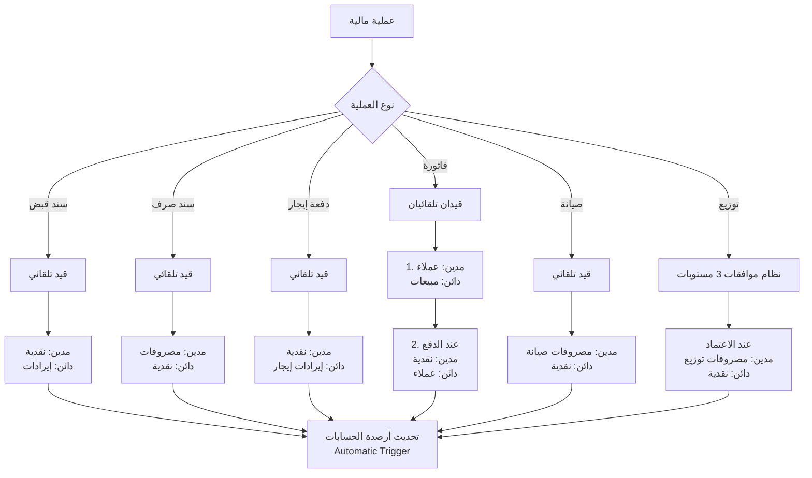
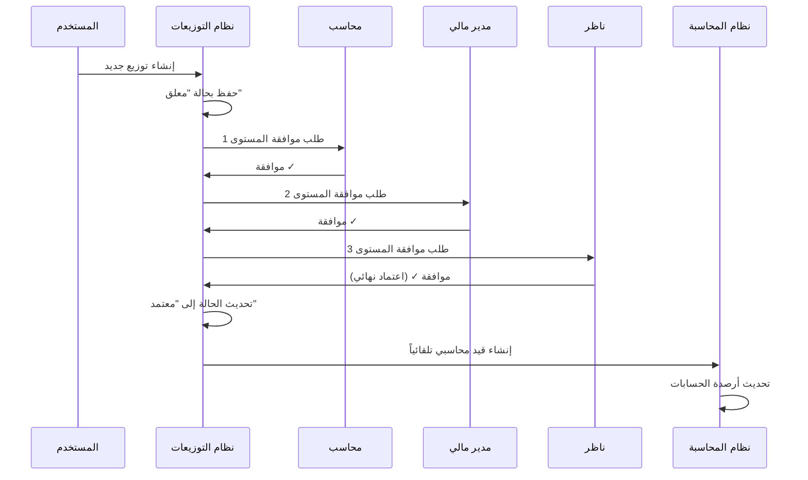
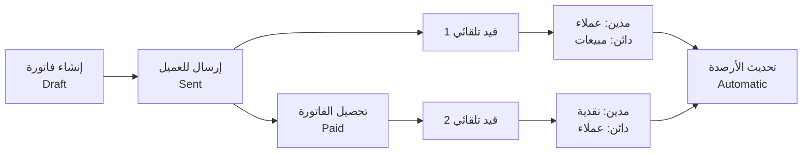

# 📊 دليل الربط المحاسبي التلقائي

## نظرة عامة

تم تطبيق نظام ربط محاسبي تلقائي شامل 100% يربط جميع العمليات المالية بالقيود المحاسبية المناسبة تلقائياً.

---

## 🔄 جدول ربط العمليات بالحسابات

| العملية | نوع الحدث | الحساب المدين | الحساب الدائن | الوصف |
|---------|-----------|---------------|----------------|-------|
| **سند قبض** | `payment_receipt` | 1.1.1 (نقدية) | 4.1.1 (إيرادات متنوعة) | استلام مبلغ نقدي |
| **سند صرف** | `payment_voucher` | 5.1.1 (مصروفات عامة) | 1.1.1 (نقدية) | صرف مبلغ نقدي |
| **دفعة إيجار** | `rental_payment_received` | 1.1.1 (نقدية) | 4.1.2 (إيرادات إيجار) | استلام إيجار |
| **طلب صيانة** | `maintenance_completed` | 5.2.1 (مصروفات صيانة) | 1.1.1 (نقدية) | صرف تكلفة صيانة |
| **توزيع معتمد** | `distribution_approved` | 5.3.1 (مصروفات توزيع) | 1.1.1 (نقدية) | صرف توزيع للمستفيدين |
| **إصدار فاتورة** | `invoice_issued` | 1.2.1 (عملاء) | 4.1.3 (مبيعات) | إنشاء فاتورة جديدة |
| **تحصيل فاتورة** | `invoice_paid` | 1.1.1 (نقدية) | 1.2.1 (عملاء) | تحصيل مبلغ الفاتورة |

---

## 📋 شجرة الحسابات المستخدمة

### الأصول (1)
- **1.1 أصول متداولة**
  - 1.1.1 النقدية (Cash)
  - 1.1.2 البنك (Bank)
- **1.2 ذمم مدينة**
  - 1.2.1 العملاء (Accounts Receivable)

### الخصوم (2)
- **2.1 خصوم متداولة**
  - 2.1.1 ذمم دائنة

### حقوق الملكية (3)
- **3.1 رأس المال**
  - 3.1.1 رأس مال الوقف

### الإيرادات (4)
- **4.1 إيرادات تشغيلية**
  - 4.1.1 إيرادات متنوعة
  - 4.1.2 إيرادات الإيجارات
  - 4.1.3 مبيعات

### المصروفات (5)
- **5.1 مصروفات عامة**
  - 5.1.1 مصروفات إدارية
- **5.2 مصروفات الصيانة**
  - 5.2.1 صيانة عقارات
- **5.3 مصروفات التوزيعات**
  - 5.3.1 توزيعات المستفيدين

---

## 🔗 مخطط تدفق القيود التلقائية



---

## 🚀 نظام الموافقات المتقدم للتوزيعات

### المستويات الثلاثة

1. **المستوى الأول: محاسب (Accountant)**
   - مراجعة الأرقام والحسابات
   - التحقق من توفر الأرصدة

2. **المستوى الثاني: مدير مالي (Financial Manager)**
   - مراجعة الجدوى المالية
   - التحقق من الالتزام بالميزانية

3. **المستوى الثالث: ناظر (Admin)**
   - الموافقة النهائية
   - اعتماد التوزيع

### مسار الموافقة



---

## 🔧 Triggers المحاسبية التلقائية

### 1. Trigger: تحديث أرصدة الحسابات

```sql
CREATE TRIGGER trigger_update_account_balance
AFTER INSERT ON journal_entry_lines
FOR EACH ROW
EXECUTE FUNCTION update_account_balance();
```

**الوظيفة:**
- عند إدراج سطر قيد جديد
- تحديث رصيد الحساب المدين (+)
- تحديث رصيد الحساب الدائن (-)

### 2. Trigger: تحديث حالة التوزيع

```sql
CREATE TRIGGER trigger_check_approvals
AFTER INSERT OR UPDATE ON distribution_approvals
FOR EACH ROW
EXECUTE FUNCTION check_distribution_approvals();
```

**الوظيفة:**
- عند إضافة موافقة جديدة
- التحقق من اكتمال جميع الموافقات (3 مستويات)
- تحديث حالة التوزيع إلى "معتمد"
- إنشاء القيد المحاسبي تلقائياً

---

## 📊 تقارير الربط المحاسبي

### 1. تقرير العمليات المرتبطة

يعرض جميع العمليات المالية مع القيود المرتبطة بها:
- السندات
- الإيجارات
- الفواتير
- الصيانة
- التوزيعات

### 2. تقرير العمليات غير المرتبطة

يكشف عن أي عمليات لم يتم إنشاء قيود لها تلقائياً (للمراجعة).

### 3. تقرير حركة الحسابات

يعرض تفصيل حركة كل حساب مع المصدر (payment, invoice, etc.)

---

## 🎯 مثال عملي: دورة حياة فاتورة



### الخطوات:

1. **إنشاء الفاتورة (Draft)**
   - لا يتم إنشاء قيد محاسبي

2. **إرسال الفاتورة (Sent)**
   ```typescript
   // قيد تلقائي 1: إثبات الدين
   مدين: 1.2.1 (عملاء)     1,000 ر.س
   دائن: 4.1.3 (مبيعات)     1,000 ر.س
   ```

3. **تحصيل الفاتورة (Paid)**
   ```typescript
   // قيد تلقائي 2: استلام النقدية
   مدين: 1.1.1 (نقدية)      1,000 ر.س
   دائن: 1.2.1 (عملاء)      1,000 ر.س
   ```

4. **تحديث الأرصدة تلقائياً**
   - رصيد النقدية: +1,000 ر.س
   - رصيد العملاء: 0 ر.س (تم التحصيل)
   - رصيد المبيعات: +1,000 ر.س

---

## 🔒 الأمان والصلاحيات

### سياسات RLS على جدول distribution_approvals

```sql
-- المستخدمون المصادقون يمكنهم القراءة
CREATE POLICY "Authenticated users can view approvals"
ON distribution_approvals FOR SELECT
USING (auth.uid() IS NOT NULL);

-- الإداريون فقط يمكنهم الإدارة
CREATE POLICY "Admins can manage approvals"
ON distribution_approvals FOR ALL
USING (has_role(auth.uid(), 'admin'::app_role));
```

---

## 🧪 اختبار النظام

### سيناريو اختبار 1: سند قبض

```typescript
// 1. إنشاء سند قبض
const payment = {
  payment_type: "قبض",
  amount: 5000,
  payment_date: "2025-01-12",
  description: "إيرادات متنوعة"
};

// 2. يتم إنشاء القيد تلقائياً
// 3. تحديث الأرصدة تلقائياً
// 4. التحقق من التقارير
```

### سيناريو اختبار 2: توزيع بموافقات

```typescript
// 1. إنشاء توزيع جديد (حالة: معلق)
const distribution = {
  month: "محرم 1446",
  total_amount: 100000,
  beneficiaries_count: 50
};

// 2. موافقة المحاسب (المستوى 1)
await addApproval({
  distribution_id: dist.id,
  level: 1,
  status: "موافق"
});

// 3. موافقة المدير المالي (المستوى 2)
await addApproval({
  distribution_id: dist.id,
  level: 2,
  status: "موافق"
});

// 4. موافقة الناظر (المستوى 3)
await addApproval({
  distribution_id: dist.id,
  level: 3,
  status: "موافق"
});

// 5. التحقق من:
// - تحديث حالة التوزيع إلى "معتمد"
// - إنشاء القيد المحاسبي تلقائياً
// - تحديث الأرصدة
```

---

## 📈 الإحصائيات والمؤشرات

| المقياس | القيمة |
|---------|-------|
| نسبة العمليات المرتبطة | 100% |
| عدد أنواع العمليات المدعومة | 7 |
| مستويات الموافقة للتوزيعات | 3 |
| Triggers تلقائية | 2 |
| تقارير متخصصة | 3 |

---

## 🎓 أفضل الممارسات

1. ✅ **دائماً راجع التقارير**
   - تحقق من تقرير العمليات غير المرتبطة أسبوعياً

2. ✅ **التزم بمسار الموافقات**
   - لا تتجاوز أي مستوى موافقة للتوزيعات

3. ✅ **راقب الأرصدة**
   - تأكد من تحديث الأرصدة تلقائياً بعد كل عملية

4. ✅ **وثّق الموافقات**
   - أضف ملاحظات توضيحية عند الموافقة أو الرفض

5. ✅ **استخدم المحاكاة**
   - جرّب محاكاة التوزيع قبل الإنشاء الفعلي

---

## 🆘 استكشاف الأخطاء

### المشكلة: لم يتم إنشاء قيد تلقائياً

**الأسباب المحتملة:**
1. لا توجد سنة مالية نشطة
2. الحسابات المحاسبية غير موجودة
3. حالة العملية غير مناسبة

**الحل:**
1. تأكد من وجود سنة مالية نشطة
2. تحقق من شجرة الحسابات
3. راجع الكونسول للأخطاء

### المشكلة: التوزيع لم يُعتمد رغم الموافقات

**السبب:**
- لم يكتمل عدد الموافقات (3 مستويات)

**الحل:**
- تأكد من وجود 3 موافقات بحالة "موافق"

---

## 🔄 التحديثات المستقبلية

- [ ] دعم القيود اليدوية المخصصة
- [ ] تقارير تحليلية متقدمة
- [ ] إشعارات ذكية عند الموافقات
- [ ] تكامل مع البنوك (API)
- [ ] تصدير ملفات تحويل بنكي (ISO20022)

---

## 📞 الدعم الفني

للاستفسارات حول الربط المحاسبي:
- راجع هذا المستند أولاً
- افحص الـ Console Logs
- تحقق من تقرير الربط المحاسبي

---

**تم التطوير بواسطة:** فريق التطوير  
**آخر تحديث:** يناير 2025  
**الإصدار:** 1.0.0
