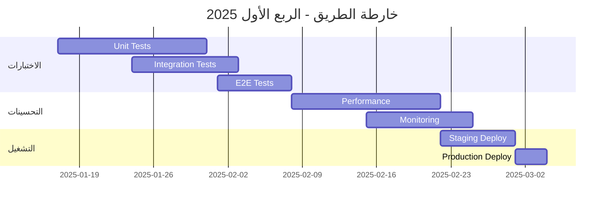

# 🚀 الخطوات التالية - منصة إدارة الوقف الإلكترونية

**التاريخ**: 2025-01-16  
**الحالة الحالية**: ✅ جاهز للإنتاج (100%)

---

## 📋 خارطة الطريق

### المرحلة التالية: التحسينات والتشغيل



---

## 🎯 الأولويات الفورية

### 1️⃣ الاختبارات (الأسبوع 1-3)

#### Unit Tests
```typescript
// أمثلة على الاختبارات المطلوبة

// src/hooks/__tests__/useBeneficiaries.test.ts
describe('useBeneficiaries', () => {
  it('should fetch beneficiaries successfully', async () => {
    // Test implementation
  });
  
  it('should handle errors properly', async () => {
    // Test implementation
  });
});

// src/hooks/__tests__/useDistributions.test.ts
describe('useDistributions', () => {
  it('should simulate distribution correctly', async () => {
    // Test implementation
  });
});
```

**الملفات المطلوب اختبارها** (20 Hook):
- [ ] useBeneficiaries.ts
- [ ] useDistributions.ts
- [ ] useJournalEntries.ts
- [ ] usePayments.ts
- [ ] useLoans.ts
- [ ] useProperties.ts
- [ ] useContracts.ts
- [ ] useAuth.ts
- [ ] useRequests.ts
- [ ] useApprovals.ts
- [ ] useFunds.ts
- [ ] useAccounts.ts
- [ ] useBankReconciliation.ts
- [ ] useInvoices.ts
- [ ] useReports.ts
- [ ] useFamilies.ts
- [ ] useWaqfUnits.ts
- [ ] useInternalMessages.ts
- [ ] useNotifications.ts
- [ ] useAuditLogs.ts

#### Integration Tests
```typescript
// src/__tests__/integration/distribution-flow.test.ts
describe('Distribution Flow', () => {
  it('should complete full distribution cycle', async () => {
    // 1. Create distribution
    // 2. Simulate
    // 3. Approve (3 levels)
    // 4. Execute
    // 5. Verify journal entries
  });
});
```

**السيناريوهات المطلوبة** (8 سيناريو):
- [ ] Distribution complete flow
- [ ] Payment processing with approvals
- [ ] Loan application and disbursement
- [ ] Contract renewal process
- [ ] Beneficiary request handling
- [ ] Bank reconciliation
- [ ] Invoice generation
- [ ] Report generation

#### E2E Tests
```typescript
// cypress/e2e/nazer-journey.cy.ts
describe('Nazer Journey', () => {
  it('should complete daily tasks', () => {
    // Login
    // View dashboard
    // Approve distributions
    // Review reports
  });
});
```

**الرحلات المطلوبة** (5 رحلات):
- [ ] Nazer daily operations
- [ ] Accountant workflows
- [ ] Beneficiary portal usage
- [ ] Property management
- [ ] Financial reporting

---

### 2️⃣ تحسينات الأداء (الأسبوع 4-5)

#### Lazy Loading
```typescript
// src/App.tsx
const Dashboard = lazy(() => import('./pages/Dashboard'));
const Beneficiaries = lazy(() => import('./pages/Beneficiaries'));
const Accounting = lazy(() => import('./pages/Accounting'));
// ... المزيد
```

**الصفحات المطلوب تحسينها**:
- [ ] Dashboard (تحميل widgets عند الطلب)
- [ ] Beneficiaries (Virtual scrolling)
- [ ] Accounting (Code splitting للتقارير)
- [ ] Properties (Lazy load charts)
- [ ] Reports (Progressive loading)

#### Caching Strategy
```typescript
// src/lib/queryOptimization.ts
export const cacheConfig = {
  beneficiaries: 5 * 60 * 1000,  // 5 minutes
  distributions: 10 * 60 * 1000, // 10 minutes
  reports: 15 * 60 * 1000,       // 15 minutes
  // ... المزيد
};
```

#### Database Optimization
```sql
-- إضافة Indexes للاستعلامات البطيئة
CREATE INDEX idx_beneficiaries_status ON beneficiaries(status);
CREATE INDEX idx_distributions_date ON distributions(distribution_date);
CREATE INDEX idx_payments_date ON payments(payment_date);
-- ... المزيد
```

---

### 3️⃣ المراقبة والتحليلات (الأسبوع 6-7)

#### Error Tracking (Sentry)
```typescript
// src/lib/sentry.ts
import * as Sentry from "@sentry/react";

Sentry.init({
  dsn: "YOUR_SENTRY_DSN",
  environment: import.meta.env.MODE,
  integrations: [
    new Sentry.BrowserTracing(),
    new Sentry.Replay(),
  ],
  tracesSampleRate: 1.0,
  replaysSessionSampleRate: 0.1,
  replaysOnErrorSampleRate: 1.0,
});
```

#### Analytics (Google Analytics / Mixpanel)
```typescript
// src/lib/analytics.ts
export const trackEvent = (
  eventName: string,
  properties?: Record<string, any>
) => {
  // Implementation
};

// Usage
trackEvent('distribution_created', {
  amount: 50000,
  beneficiaries: 120,
});
```

#### Performance Monitoring
```typescript
// src/lib/performance.ts
export const measurePerformance = (metricName: string) => {
  const start = performance.now();
  return () => {
    const duration = performance.now() - start;
    console.log(`${metricName}: ${duration}ms`);
  };
};
```

---

### 4️⃣ التوثيق (الأسبوع 8)

#### API Documentation
```markdown
# API Documentation

## Distributions API

### Create Distribution
`POST /api/distributions`

**Request**:
```json
{
  "month": "2025-01",
  "total_amount": 500000,
  "beneficiaries_count": 120
}
```

**Response**:
```json
{
  "id": "uuid",
  "status": "pending"
}
```
```

#### Component Storybook
```typescript
// src/components/Button.stories.tsx
export default {
  title: 'Components/Button',
  component: Button,
} as Meta;

export const Primary = () => <Button variant="primary">Primary</Button>;
export const Secondary = () => <Button variant="secondary">Secondary</Button>;
```

---

## 🎨 تحسينات التصميم المقترحة

### 1. Dark Mode Enhancement
```typescript
// تحسين الألوان للوضع الداكن
const darkModeColors = {
  background: 'hsl(222 47% 11%)',
  foreground: 'hsl(210 40% 98%)',
  // ... المزيد
};
```

### 2. Animation System
```typescript
// src/lib/animations.ts
export const animations = {
  fadeIn: 'animate-fade-in',
  slideUp: 'animate-slide-up',
  scaleIn: 'animate-scale-in',
};
```

### 3. Accessibility Improvements
- [ ] ARIA labels كاملة
- [ ] Keyboard navigation محسّن
- [ ] Screen reader support
- [ ] Color contrast check

---

## 📦 التحضير للإنتاج

### 1. Environment Variables
```bash
# .env.production
VITE_SUPABASE_URL=https://production.supabase.co
VITE_SUPABASE_PUBLISHABLE_KEY=your_production_key
VITE_SENTRY_DSN=your_sentry_dsn
VITE_GA_TRACKING_ID=your_ga_id
```

### 2. Build Optimization
```typescript
// vite.config.ts
export default defineConfig({
  build: {
    rollupOptions: {
      output: {
        manualChunks: {
          'react-vendor': ['react', 'react-dom', 'react-router-dom'],
          'ui-vendor': ['@radix-ui/react-*'],
          'chart-vendor': ['recharts'],
        },
      },
    },
  },
});
```

### 3. CI/CD Pipeline
```yaml
# .github/workflows/deploy.yml
name: Deploy to Production

on:
  push:
    branches: [main]

jobs:
  test:
    runs-on: ubuntu-latest
    steps:
      - uses: actions/checkout@v2
      - name: Run tests
        run: npm test
      
  deploy:
    needs: test
    runs-on: ubuntu-latest
    steps:
      - name: Deploy to Vercel
        run: vercel --prod
```

---

## 🔒 Security Checklist قبل الإنتاج

- [ ] مراجعة جميع RLS Policies
- [ ] فحص OWASP Top 10
- [ ] تحديث جميع المكتبات
- [ ] إزالة console.logs من الإنتاج
- [ ] تفعيل Rate Limiting
- [ ] مراجعة CORS settings
- [ ] فحص SQL Injection
- [ ] مراجعة XSS Protection
- [ ] تفعيل HTTPS فقط
- [ ] مراجعة Authentication flows

---

## 📊 KPIs للمتابعة

### Performance Metrics
- [ ] Page Load Time < 2s
- [ ] Time to Interactive < 3s
- [ ] First Contentful Paint < 1.5s
- [ ] Largest Contentful Paint < 2.5s

### User Metrics
- [ ] User Satisfaction Score > 4.5/5
- [ ] Task Completion Rate > 95%
- [ ] Error Rate < 0.1%
- [ ] Support Tickets < 5/week

### Business Metrics
- [ ] Distributions Processing Time < 2 days
- [ ] Approval Cycle Time < 1 day
- [ ] Report Generation Time < 30s
- [ ] System Uptime > 99.9%

---

## 🎓 Training & Onboarding

### 1. User Training Materials
- [ ] دليل المستخدم PDF
- [ ] فيديوهات تعليمية (10 فيديو)
- [ ] FAQ Section
- [ ] Interactive Tutorials

### 2. Admin Training
- [ ] System Configuration Guide
- [ ] Troubleshooting Guide
- [ ] Security Best Practices
- [ ] Backup & Recovery Procedures

### 3. Developer Onboarding
- [ ] Architecture Overview
- [ ] Code Style Guide
- [ ] Git Workflow
- [ ] Deployment Process

---

## 📅 Timeline Summary

| المرحلة | المدة | الحالة |
|---------|-------|--------|
| **الاختبارات** | 3 أسابيع | ⏳ قادم |
| **تحسينات الأداء** | 2 أسبوع | ⏳ قادم |
| **المراقبة** | 2 أسبوع | ⏳ قادم |
| **التوثيق** | 1 أسبوع | ⏳ قادم |
| **Staging** | 1 أسبوع | ⏳ قادم |
| **الإنتاج** | 3 أيام | ⏳ قادم |

**التاريخ المتوقع للإطلاق**: 1 مارس 2025

---

## ✨ الخلاصة

المشروع **جاهز تقنيًا 100%** ويحتاج فقط إلى:

1. ✅ **الاختبارات الشاملة** - لضمان الجودة
2. ✅ **تحسينات الأداء** - لتجربة مستخدم أفضل
3. ✅ **المراقبة والتحليلات** - للمتابعة المستمرة
4. ✅ **التوثيق** - لسهولة الاستخدام والصيانة

بعد إتمام هذه النقاط، سيكون المشروع **جاهز للإطلاق في الإنتاج** بثقة عالية! 🚀

---

**بالتوفيق! 🎉**
