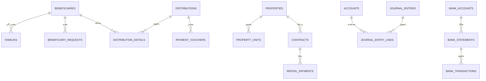
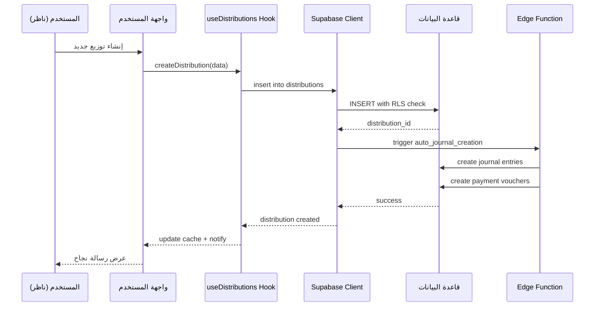

# البنية المعمارية لنظام إدارة الوقف الإلكتروني

## 📋 نظرة عامة

منصة **Waqf Wise** هي نظام شامل لإدارة الأوقاف الإلكترونية، مبنية على تقنيات حديثة ومعمارية قابلة للتوسع.

### التقنيات الأساسية
- **Frontend**: React 18.3 + TypeScript + Vite
- **UI Framework**: Tailwind CSS + Shadcn/ui
- **Backend**: Supabase (PostgreSQL + Edge Functions)
- **State Management**: TanStack Query (React Query)
- **Routing**: React Router v6
- **Authentication**: Supabase Auth

---

## 🏗️ هيكل المشروع

```
waqf-wise/
├── src/
│   ├── components/          # المكونات القابلة لإعادة الاستخدام
│   │   ├── ui/             # مكونات Shadcn UI الأساسية
│   │   ├── layout/         # مكونات التخطيط والهيكل
│   │   ├── shared/         # مكونات مشتركة بين الصفحات
│   │   ├── accounting/     # مكونات النظام المحاسبي
│   │   ├── beneficiary/    # مكونات إدارة المستفيدين
│   │   ├── properties/     # مكونات إدارة العقارات
│   │   ├── funds/          # مكونات إدارة الصناديق
│   │   ├── distributions/  # مكونات التوزيعات
│   │   └── ...             # 38+ مجلد مكونات متخصصة
│   │
│   ├── pages/              # 72 صفحة للتطبيق
│   │   ├── Index.tsx       # الصفحة الرئيسية
│   │   ├── Dashboard.tsx   # لوحة التحكم
│   │   ├── Beneficiaries.tsx
│   │   ├── Properties.tsx
│   │   ├── Accounting.tsx
│   │   ├── Distributions.tsx
│   │   └── ...
│   │
│   ├── hooks/              # Custom React Hooks
│   │   ├── useBeneficiaries.ts
│   │   ├── useAccounting.ts
│   │   ├── useProperties.ts
│   │   └── ...
│   │
│   ├── integrations/       # تكاملات خارجية
│   │   └── supabase/
│   │       ├── client.ts   # Supabase Client (auto-generated)
│   │       └── types.ts    # Database Types (auto-generated)
│   │
│   ├── lib/                # وظائف مساعدة
│   │   └── utils.ts
│   │
│   └── App.tsx             # مكون التطبيق الرئيسي
│
├── supabase/
│   ├── migrations/         # 247+ ملف migration
│   ├── functions/          # Edge Functions
│   └── config.toml         # إعدادات Supabase
│
├── public/                 # ملفات ثابتة
├── docs/                   # التوثيق
└── scripts/                # سكريبتات مساعدة
```

---

## 🎯 الطبقات المعمارية

### 1️⃣ **طبقة العرض (Presentation Layer)**
- **المسؤولية**: واجهة المستخدم والتفاعل
- **التقنيات**: React Components + Tailwind CSS
- **الأنماط**:
  - **Atomic Design**: مكونات UI أساسية في `components/ui/`
  - **Feature-based Components**: مكونات متخصصة حسب الميزة
  - **Mobile-First Design**: تصميم متجاوب يبدأ من الأجهزة المحمولة

#### مكونات التخطيط الأساسية:
```typescript
// المكونات الرئيسية للتخطيط
components/layout/
├── Sidebar.tsx              # القائمة الجانبية
├── Header.tsx               # الشريط العلوي
├── MobileOptimizedLayout.tsx # تخطيط محسّن للموبايل
└── MainLayout.tsx           # التخطيط الرئيسي
```

### 2️⃣ **طبقة منطق الأعمال (Business Logic Layer)**
- **المسؤولية**: معالجة البيانات والقواعد التجارية
- **التقنيات**: Custom Hooks + React Query
- **الأنماط**:
  - **Custom Hooks Pattern**: كل ميزة لها Hook مخصص
  - **Optimistic Updates**: تحديثات فورية للتجربة السلسة
  - **Automatic Caching**: تخزين مؤقت تلقائي للبيانات

#### أمثلة على Custom Hooks:
```typescript
// إدارة المستفيدين
hooks/useBeneficiaries.ts
  ├── useAddBeneficiary()
  ├── useUpdateBeneficiary()
  └── useBeneficiaryActivity()

// النظام المحاسبي
hooks/useAccounting.ts
  ├── useJournalEntries()
  ├── useAutoJournalEntries()
  └── useFinancialReports()
```

### 3️⃣ **طبقة الوصول للبيانات (Data Access Layer)**
- **المسؤولية**: التواصل مع قاعدة البيانات
- **التقنيات**: Supabase Client + PostgreSQL
- **الأنماط**:
  - **Repository Pattern**: واجهات منظمة للوصول للبيانات
  - **Type-Safe Queries**: استعلامات آمنة من ناحية الأنواع
  - **RLS Policies**: سياسات أمان على مستوى الصفوف

### 4️⃣ **طبقة الخدمات الخلفية (Backend Services Layer)**
- **المسؤولية**: معالجة العمليات الخلفية المعقدة
- **التقنيات**: Supabase Edge Functions
- **الاستخدامات**:
  - توليد التقارير المعقدة
  - معالجة الدفعات
  - التكامل مع APIs خارجية
  - المهام المجدولة

---

## 🗄️ معمارية قاعدة البيانات

### الجداول الرئيسية (247+ Migration)

#### 1. **نظام المستفيدين**
```sql
beneficiaries                 -- المستفيدون الرئيسيون
├── families                  -- العائلات
├── beneficiary_activity_log  -- سجل النشاط
├── beneficiary_attachments   -- المرفقات
├── beneficiary_changes_log   -- سجل التغييرات
└── beneficiary_requests      -- الطلبات
```

#### 2. **النظام المحاسبي**
```sql
accounts                      -- شجرة الحسابات
├── journal_entries          -- القيود اليومية
├── journal_entry_lines      -- تفاصيل القيود
├── auto_journal_templates   -- قوالب القيود التلقائية
├── auto_journal_log         -- سجل القيود التلقائية
├── fiscal_years             -- السنوات المالية
└── approval_workflows       -- مسارات الموافقات
```

#### 3. **إدارة العقارات**
```sql
properties                    -- العقارات
├── property_units           -- الوحدات العقارية
├── contracts                -- العقود
├── rental_payments          -- دفعات الإيجار
├── maintenance_requests     -- طلبات الصيانة
└── maintenance_schedules    -- جداول الصيانة
```

#### 4. **إدارة الصناديق والتوزيعات**
```sql
funds                        -- الصناديق
├── distributions            -- التوزيعات
├── distribution_details     -- تفاصيل التوزيعات
├── payment_vouchers         -- سندات الصرف
└── bank_transfer_files      -- ملفات التحويل البنكي
```

#### 5. **النظام البنكي**
```sql
bank_accounts                -- الحسابات البنكية
├── bank_statements          -- كشوف الحساب
├── bank_transactions        -- المعاملات البنكية
├── bank_reconciliation      -- التسويات البنكية
└── bank_integrations        -- تكاملات بنكية
```

#### 6. **نظام الإشعارات والتنبيهات**
```sql
notifications                -- الإشعارات
├── notification_preferences -- تفضيلات الإشعارات
├── system_alerts           -- التنبيهات النظامية
└── alert_escalations       -- تصعيد التنبيهات
```

### العلاقات بين الجداول



---

## 🔐 معمارية الأمان

### 1. **المصادقة (Authentication)**
- Supabase Auth مع دعم:
  - Email/Password
  - Magic Links
  - OAuth Providers (Google, etc.)
  - 2FA (Two-Factor Authentication)

### 2. **التفويض (Authorization)**
- **Row Level Security (RLS)**: سياسات أمان على مستوى الصفوف
- **Role-Based Access Control (RBAC)**: صلاحيات حسب الدور
- **Attribute-Based Access Control (ABAC)**: صلاحيات حسب الصفات

### 3. **الأدوار الرئيسية**
```typescript
enum UserRole {
  ADMIN = "admin",              // مدير النظام
  NAZER = "nazer",             // الناظر
  ACCOUNTANT = "accountant",   // محاسب
  CASHIER = "cashier",         // أمين الصندوق
  VIEWER = "viewer",           // مستعرض
  BENEFICIARY = "beneficiary"  // مستفيد
}
```

---

## 🔄 تدفق البيانات

### مثال: تدفق إنشاء توزيع جديد



---

## 📊 الأنظمة الفرعية

### 1. **نظام المستفيدين (Beneficiary Management)**
- إدارة بيانات المستفيدين والعائلات
- تتبع النشاط والتغييرات
- إدارة الطلبات (فزعات، قروض، تحديث بيانات)
- المرفقات والوثائق

**الصفحات الرئيسية:**
- `/beneficiaries` - قائمة المستفيدين
- `/beneficiaries/:id` - ملف المستفيد
- `/beneficiary-portal` - بوابة المستفيد
- `/beneficiary-requests` - طلبات المستفيدين

### 2. **النظام المحاسبي (Accounting System)**
- شجرة الحسابات متعددة المستويات
- القيود اليومية (يدوية وتلقائية)
- التقارير المالية (ميزان المراجعة، القوائم المالية)
- السنوات المالية وإقفال الحسابات
- مسارات الموافقات

**الصفحات الرئيسية:**
- `/accounting` - لوحة المحاسبة
- `/journal-entries` - القيود اليومية
- `/accounts` - شجرة الحسابات
- `/fiscal-years` - السنوات المالية
- `/financial-reports` - التقارير المالية

### 3. **إدارة العقارات (Property Management)**
- تسجيل العقارات والوحدات
- إدارة العقود والإيجارات
- الصيانة والجداول الدورية
- تقارير العوائد والنفقات

**الصفحات الرئيسية:**
- `/properties` - قائمة العقارات
- `/properties/:id` - تفاصيل العقار
- `/contracts` - العقود
- `/maintenance` - الصيانة

### 4. **إدارة الصناديق والتوزيعات (Funds & Distributions)**
- تعريف الصناديق وقواعد التوزيع
- محاكاة التوزيعات قبل التنفيذ
- إنشاء سندات الصرف
- توليد ملفات التحويل البنكي
- مسارات الموافقات

**الصفحات الرئيسية:**
- `/funds` - الصناديق
- `/distributions` - التوزيعات
- `/distributions/new` - توزيع جديد
- `/payment-vouchers` - سندات الصرف

### 5. **النظام البنكي (Banking System)**
- إدارة الحسابات البنكية
- كشوف الحساب والتسويات
- التحويلات البنكية
- التكامل مع البنوك

**الصفحات الرئيسية:**
- `/bank-accounts` - الحسابات البنكية
- `/bank-reconciliation` - التسويات البنكية
- `/bank-transfers` - التحويلات

### 6. **نظام التقارير (Reporting System)**
- تقارير تشغيلية
- تقارير مالية
- تقارير تحليلية
- تقارير مخصصة
- تصدير متعدد الصيغ (PDF, Excel)

**الصفحات الرئيسية:**
- `/reports` - مركز التقارير
- `/reports/custom` - تقارير مخصصة
- `/dashboards` - لوحات المعلومات

### 7. **نظام الأرشفة (Archive System)**
- أرشفة المستندات الإلكترونية
- شجرة أرشفة منظمة
- إصدارات المستندات
- البحث الذكي في المحتوى

**الصفحات الرئيسية:**
- `/archive` - الأرشيف الإلكتروني
- `/archive/search` - البحث في الأرشيف

### 8. **نظام الإشعارات (Notification System)**
- إشعارات فورية
- إشعارات بريد إلكتروني
- إشعارات SMS
- تفضيلات الإشعارات

### 9. **نظام الشفافية (Transparency System)**
- الإفصاح السنوي
- تقارير الشفافية العامة
- لوحة معلومات عامة
- إعدادات الرؤية

**الصفحات الرئيسية:**
- `/transparency` - الشفافية العامة
- `/annual-disclosure` - الإفصاح السنوي
- `/transparency-settings` - إعدادات الشفافية

---

## 🎨 نظام التصميم

### Design Tokens
جميع الألوان والأنماط مركزية في:
- `src/index.css` - متغيرات CSS
- `tailwind.config.ts` - إعدادات Tailwind

### المبادئ:
1. **استخدام Semantic Tokens**: ألوان دلالية بدلاً من ألوان مباشرة
2. **Dark Mode Support**: دعم الوضع الليلي
3. **RTL Support**: دعم الاتجاه من اليمين لليسار
4. **Mobile-First**: تصميم يبدأ من الموبايل

### مثال:
```css
/* ✅ صحيح - استخدام semantic tokens */
.button {
  background: hsl(var(--primary));
  color: hsl(var(--primary-foreground));
}

/* ❌ خطأ - استخدام ألوان مباشرة */
.button {
  background: #3b82f6;
  color: white;
}
```

---

## 🚀 الأداء والتحسين

### 1. **Code Splitting**
- تقسيم الكود حسب المسارات (Route-based)
- تحميل المكونات بشكل lazy

### 2. **React Query Caching**
- تخزين مؤقت ذكي للبيانات
- تحديثات تفاؤلية (Optimistic Updates)
- إعادة جلب تلقائية في الخلفية

### 3. **Database Indexing**
- فهرسة الأعمدة المستخدمة بكثرة
- فهارس مركبة للاستعلامات المعقدة

### 4. **Image Optimization**
- استخدام WebP format
- Lazy loading للصور
- Responsive images

---

## 📦 النشر والاستضافة

### البيئات:
1. **Development**: بيئة التطوير المحلية
2. **Staging**: بيئة الاختبار (lovable.app)
3. **Production**: البيئة الإنتاجية

### النشر:
- **Frontend**: Netlify / Vercel
- **Backend**: Supabase Cloud
- **Database**: PostgreSQL (Supabase)
- **Storage**: Supabase Storage

### CI/CD:
- GitHub Actions للأتمتة
- اختبارات تلقائية قبل النشر
- نشر تلقائي عند الدمج

---

## 🔄 استراتيجية التحديثات

### 1. **Database Migrations**
- استخدام نظام migrations لتغييرات قاعدة البيانات
- إمكانية الرجوع للإصدارات السابقة (Rollback)
- تتبع جميع التغييرات

### 2. **Feature Flags**
- إمكانية تفعيل/إيقاف ميزات بدون نشر
- اختبار ميزات جديدة على مجموعة محدودة

### 3. **Versioning**
- Semantic Versioning (MAJOR.MINOR.PATCH)
- ملف CHANGELOG.md لتتبع التغييرات

---

## 📚 المراجع والموارد

### التوثيق الداخلي:
- [دليل المطور](./DEVELOPER_GUIDE.md)
- [دليل الاختبار](./TESTING.md)
- [مخطط قاعدة البيانات](./DATABASE_SCHEMA.md)
- [دليل تنظيف قاعدة البيانات](./DATABASE_CLEANUP_GUIDE.md)
- [مرجع API](./API_REFERENCE.md)
- [دليل استكشاف الأخطاء](./TROUBLESHOOTING_GUIDE.md)
- [نظام التصميم](./DESIGN_SYSTEM.md)
- [سجل التغييرات](../CHANGELOG.md)
- [تقرير التدقيق النهائي](./FINAL_AUDIT_REPORT.md)
- [خطة التحسين النهائية](./FINAL_OPTIMIZATION_PLAN.md)
- [استكشاف الأخطاء](./TROUBLESHOOTING_GUIDE.md)

### الموارد الخارجية:
- [React Documentation](https://react.dev)
- [Supabase Documentation](https://supabase.com/docs)
- [Tailwind CSS](https://tailwindcss.com)
- [TanStack Query](https://tanstack.com/query)
- [Shadcn/ui](https://ui.shadcn.com)

---

## 📞 الدعم والمساهمة

للاستفسارات أو المساهمات، راجع:
- [دليل المساهمة](../CONTRIBUTING.md)
- [الأمان](../SECURITY.md)
- [خارطة الطريق](../ROADMAP.md)

---

**آخر تحديث**: 2025
**الإصدار**: 1.0.0
