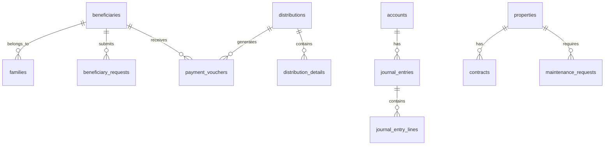

# 🗄️ توثيق قاعدة البيانات - منصة إدارة الوقف

## 📊 نظرة عامة

قاعدة البيانات مبنية على **Supabase (PostgreSQL)** وتحتوي على **80+ جدول** لإدارة جميع جوانب الوقف.

---

## 🏛️ المخطط العام



---

## 👥 جداول المستفيدين

### `beneficiaries` - المستفيدون
```sql
CREATE TABLE beneficiaries (
  id UUID PRIMARY KEY DEFAULT gen_random_uuid(),
  full_name TEXT NOT NULL,
  national_id TEXT UNIQUE NOT NULL,
  phone TEXT NOT NULL,
  email TEXT,
  category TEXT NOT NULL,
  status TEXT DEFAULT 'active',
  
  -- البيانات الشخصية
  gender TEXT,
  date_of_birth DATE,
  marital_status TEXT,
  nationality TEXT,
  city TEXT,
  address TEXT,
  
  -- البيانات البنكية
  bank_name TEXT,
  bank_account_number TEXT,
  iban TEXT,
  
  -- بيانات العائلة
  family_id UUID REFERENCES families(id),
  is_head_of_family BOOLEAN DEFAULT false,
  family_size INTEGER,
  number_of_wives INTEGER DEFAULT 0,
  number_of_sons INTEGER DEFAULT 0,
  number_of_daughters INTEGER DEFAULT 0,
  
  -- البيانات المالية
  account_balance DECIMAL(15,2) DEFAULT 0,
  total_received DECIMAL(15,2) DEFAULT 0,
  pending_amount DECIMAL(15,2) DEFAULT 0,
  monthly_income DECIMAL(15,2),
  
  -- التحقق
  verification_status TEXT DEFAULT 'pending',
  verified_at TIMESTAMP,
  verified_by UUID,
  
  -- المصادقة
  user_id UUID REFERENCES auth.users(id),
  can_login BOOLEAN DEFAULT false,
  
  created_at TIMESTAMP DEFAULT now(),
  updated_at TIMESTAMP DEFAULT now()
);
```

### `families` - العائلات
```sql
CREATE TABLE families (
  id UUID PRIMARY KEY DEFAULT gen_random_uuid(),
  family_name TEXT NOT NULL,
  head_id UUID REFERENCES beneficiaries(id),
  tribe TEXT,
  members_count INTEGER DEFAULT 0,
  notes TEXT,
  created_at TIMESTAMP DEFAULT now()
);
```

### `beneficiary_requests` - طلبات المستفيدين
```sql
CREATE TABLE beneficiary_requests (
  id UUID PRIMARY KEY DEFAULT gen_random_uuid(),
  beneficiary_id UUID REFERENCES beneficiaries(id),
  request_type_id UUID REFERENCES request_types(id),
  request_number TEXT UNIQUE,
  description TEXT NOT NULL,
  amount DECIMAL(15,2),
  status TEXT DEFAULT 'pending',
  priority TEXT DEFAULT 'normal',
  
  -- التعيين
  assigned_to UUID,
  assigned_at TIMESTAMP,
  
  -- SLA
  sla_due_at TIMESTAMP,
  is_overdue BOOLEAN DEFAULT false,
  
  -- القرار
  decision_notes TEXT,
  rejection_reason TEXT,
  approved_at TIMESTAMP,
  
  created_at TIMESTAMP DEFAULT now(),
  updated_at TIMESTAMP DEFAULT now()
);
```

---

## 💰 جداول المحاسبة

### `accounts` - شجرة الحسابات
```sql
CREATE TABLE accounts (
  id UUID PRIMARY KEY DEFAULT gen_random_uuid(),
  code TEXT UNIQUE NOT NULL,
  name_ar TEXT NOT NULL,
  name_en TEXT,
  account_type account_type NOT NULL,
  account_nature account_nature NOT NULL,
  parent_id UUID REFERENCES accounts(id),
  is_header BOOLEAN DEFAULT false,
  is_active BOOLEAN DEFAULT true,
  current_balance DECIMAL(15,2) DEFAULT 0,
  description TEXT,
  created_at TIMESTAMP DEFAULT now()
);

-- أنواع الحسابات
CREATE TYPE account_type AS ENUM (
  'asset',      -- أصول
  'liability',  -- خصوم
  'equity',     -- حقوق ملكية
  'revenue',    -- إيرادات
  'expense'     -- مصروفات
);

-- طبيعة الحساب
CREATE TYPE account_nature AS ENUM (
  'debit',   -- مدين
  'credit'   -- دائن
);
```

### `journal_entries` - القيود المحاسبية
```sql
CREATE TABLE journal_entries (
  id UUID PRIMARY KEY DEFAULT gen_random_uuid(),
  entry_number TEXT UNIQUE NOT NULL,
  entry_date DATE NOT NULL,
  description TEXT NOT NULL,
  reference_type TEXT,
  reference_id UUID,
  total_debit DECIMAL(15,2) NOT NULL,
  total_credit DECIMAL(15,2) NOT NULL,
  status TEXT DEFAULT 'draft',
  
  -- الترحيل
  posted_at TIMESTAMP,
  posted_by UUID,
  
  -- الإلغاء
  reversed BOOLEAN DEFAULT false,
  reversal_entry_id UUID,
  
  created_by UUID,
  created_at TIMESTAMP DEFAULT now()
);
```

### `journal_entry_lines` - سطور القيد
```sql
CREATE TABLE journal_entry_lines (
  id UUID PRIMARY KEY DEFAULT gen_random_uuid(),
  journal_entry_id UUID REFERENCES journal_entries(id),
  account_id UUID REFERENCES accounts(id),
  description TEXT,
  debit_amount DECIMAL(15,2) DEFAULT 0,
  credit_amount DECIMAL(15,2) DEFAULT 0,
  cost_center_id UUID,
  created_at TIMESTAMP DEFAULT now()
);
```

### `bank_accounts` - الحسابات البنكية
```sql
CREATE TABLE bank_accounts (
  id UUID PRIMARY KEY DEFAULT gen_random_uuid(),
  bank_name TEXT NOT NULL,
  account_number TEXT NOT NULL,
  iban TEXT,
  swift_code TEXT,
  currency TEXT DEFAULT 'SAR',
  current_balance DECIMAL(15,2) DEFAULT 0,
  account_id UUID REFERENCES accounts(id),
  is_active BOOLEAN DEFAULT true,
  created_at TIMESTAMP DEFAULT now()
);
```

---

## 📤 جداول التوزيعات

### `distributions` - التوزيعات
```sql
CREATE TABLE distributions (
  id UUID PRIMARY KEY DEFAULT gen_random_uuid(),
  distribution_number TEXT UNIQUE,
  fund_id UUID REFERENCES funds(id),
  fiscal_year_id UUID REFERENCES fiscal_years(id),
  distribution_date DATE NOT NULL,
  total_amount DECIMAL(15,2) NOT NULL,
  distributed_amount DECIMAL(15,2) DEFAULT 0,
  
  -- الاستقطاعات
  nazer_percentage DECIMAL(5,2) DEFAULT 0,
  nazer_share DECIMAL(15,2) DEFAULT 0,
  reserve_percentage DECIMAL(5,2) DEFAULT 0,
  reserve_share DECIMAL(15,2) DEFAULT 0,
  development_percentage DECIMAL(5,2) DEFAULT 0,
  development_share DECIMAL(15,2) DEFAULT 0,
  
  status TEXT DEFAULT 'draft',
  approved_at TIMESTAMP,
  approved_by UUID,
  executed_at TIMESTAMP,
  
  notes TEXT,
  created_by UUID,
  created_at TIMESTAMP DEFAULT now()
);
```

### `distribution_details` - تفاصيل التوزيع
```sql
CREATE TABLE distribution_details (
  id UUID PRIMARY KEY DEFAULT gen_random_uuid(),
  distribution_id UUID REFERENCES distributions(id),
  beneficiary_id UUID REFERENCES beneficiaries(id),
  amount DECIMAL(15,2) NOT NULL,
  share_percentage DECIMAL(5,2),
  status TEXT DEFAULT 'pending',
  payment_voucher_id UUID,
  paid_at TIMESTAMP,
  created_at TIMESTAMP DEFAULT now()
);
```

### `payment_vouchers` - سندات الصرف
```sql
CREATE TABLE payment_vouchers (
  id UUID PRIMARY KEY DEFAULT gen_random_uuid(),
  voucher_number TEXT UNIQUE NOT NULL,
  voucher_date DATE NOT NULL,
  beneficiary_id UUID REFERENCES beneficiaries(id),
  distribution_id UUID REFERENCES distributions(id),
  amount DECIMAL(15,2) NOT NULL,
  payment_method TEXT DEFAULT 'bank_transfer',
  bank_account_id UUID REFERENCES bank_accounts(id),
  
  status TEXT DEFAULT 'pending',
  paid_at TIMESTAMP,
  paid_by UUID,
  
  journal_entry_id UUID REFERENCES journal_entries(id),
  
  notes TEXT,
  created_by UUID,
  created_at TIMESTAMP DEFAULT now()
);
```

---

## 🏢 جداول العقارات

### `properties` - العقارات
```sql
CREATE TABLE properties (
  id UUID PRIMARY KEY DEFAULT gen_random_uuid(),
  name TEXT NOT NULL,
  property_type TEXT NOT NULL,
  address TEXT,
  city TEXT,
  district TEXT,
  area_sqm DECIMAL(10,2),
  
  -- القيمة
  purchase_value DECIMAL(15,2),
  current_value DECIMAL(15,2),
  annual_revenue DECIMAL(15,2),
  
  -- الحالة
  status TEXT DEFAULT 'active',
  occupancy_status TEXT DEFAULT 'vacant',
  
  -- الوقف
  waqf_unit_id UUID REFERENCES waqf_units(id),
  
  notes TEXT,
  created_at TIMESTAMP DEFAULT now()
);
```

### `contracts` - العقود
```sql
CREATE TABLE contracts (
  id UUID PRIMARY KEY DEFAULT gen_random_uuid(),
  contract_number TEXT UNIQUE,
  property_id UUID REFERENCES properties(id),
  tenant_name TEXT NOT NULL,
  tenant_phone TEXT,
  tenant_id_number TEXT,
  
  -- فترة العقد
  start_date DATE NOT NULL,
  end_date DATE NOT NULL,
  
  -- القيمة
  monthly_rent DECIMAL(15,2) NOT NULL,
  annual_rent DECIMAL(15,2),
  deposit_amount DECIMAL(15,2) DEFAULT 0,
  
  -- الحالة
  status TEXT DEFAULT 'active',
  
  -- التجديد
  auto_renew BOOLEAN DEFAULT false,
  renewal_reminder_days INTEGER DEFAULT 30,
  
  created_at TIMESTAMP DEFAULT now()
);
```

### `maintenance_requests` - طلبات الصيانة
```sql
CREATE TABLE maintenance_requests (
  id UUID PRIMARY KEY DEFAULT gen_random_uuid(),
  property_id UUID REFERENCES properties(id),
  title TEXT NOT NULL,
  description TEXT,
  category TEXT,
  priority TEXT DEFAULT 'normal',
  status TEXT DEFAULT 'pending',
  
  -- التكلفة
  estimated_cost DECIMAL(15,2),
  actual_cost DECIMAL(15,2),
  
  -- التنفيذ
  assigned_to UUID,
  completed_at TIMESTAMP,
  
  created_at TIMESTAMP DEFAULT now()
);
```

---

## 👤 جداول المستخدمين

### `user_roles` - أدوار المستخدمين
```sql
CREATE TABLE user_roles (
  id UUID PRIMARY KEY DEFAULT gen_random_uuid(),
  user_id UUID REFERENCES auth.users(id),
  role TEXT NOT NULL,
  assigned_at TIMESTAMP DEFAULT now(),
  assigned_by UUID,
  is_active BOOLEAN DEFAULT true,
  UNIQUE(user_id, role)
);
```

### `role_permissions` - صلاحيات الأدوار
```sql
CREATE TABLE role_permissions (
  id UUID PRIMARY KEY DEFAULT gen_random_uuid(),
  role TEXT NOT NULL,
  permission TEXT NOT NULL,
  resource TEXT,
  actions TEXT[] DEFAULT '{}',
  created_at TIMESTAMP DEFAULT now(),
  UNIQUE(role, permission)
);
```

---

## 🔔 جداول الإشعارات

### `notifications` - الإشعارات
```sql
CREATE TABLE notifications (
  id UUID PRIMARY KEY DEFAULT gen_random_uuid(),
  user_id UUID REFERENCES auth.users(id),
  title TEXT NOT NULL,
  message TEXT NOT NULL,
  type TEXT DEFAULT 'info',
  category TEXT,
  priority TEXT DEFAULT 'normal',
  
  -- الحالة
  is_read BOOLEAN DEFAULT false,
  read_at TIMESTAMP,
  
  -- الإجراء
  action_url TEXT,
  action_label TEXT,
  
  -- المرجع
  reference_type TEXT,
  reference_id UUID,
  
  created_at TIMESTAMP DEFAULT now()
);
```

---

## 📁 جداول الأرشيف

### `documents` - المستندات
```sql
CREATE TABLE documents (
  id UUID PRIMARY KEY DEFAULT gen_random_uuid(),
  title TEXT NOT NULL,
  description TEXT,
  file_path TEXT NOT NULL,
  file_name TEXT NOT NULL,
  file_size BIGINT,
  mime_type TEXT,
  
  -- التصنيف
  folder_id UUID REFERENCES folders(id),
  category TEXT,
  tags TEXT[],
  
  -- المرجع
  reference_type TEXT,
  reference_id UUID,
  
  -- الإصدار
  version INTEGER DEFAULT 1,
  
  uploaded_by UUID,
  created_at TIMESTAMP DEFAULT now()
);
```

---

## 🔒 سياسات RLS

### مثال على سياسة المستفيدين
```sql
-- السماح للمستفيد برؤية بياناته فقط
CREATE POLICY "beneficiaries_select_own"
ON beneficiaries FOR SELECT
USING (
  user_id = auth.uid() 
  OR EXISTS (
    SELECT 1 FROM user_roles 
    WHERE user_id = auth.uid() 
    AND role IN ('admin', 'nazer', 'staff')
  )
);

-- السماح للموظفين بالتعديل
CREATE POLICY "beneficiaries_update"
ON beneficiaries FOR UPDATE
USING (
  EXISTS (
    SELECT 1 FROM user_roles 
    WHERE user_id = auth.uid() 
    AND role IN ('admin', 'staff')
  )
);
```

---

## 📈 الفهارس

```sql
-- فهارس المستفيدين
CREATE INDEX idx_beneficiaries_national_id ON beneficiaries(national_id);
CREATE INDEX idx_beneficiaries_family_id ON beneficiaries(family_id);
CREATE INDEX idx_beneficiaries_status ON beneficiaries(status);

-- فهارس القيود
CREATE INDEX idx_journal_entries_date ON journal_entries(entry_date);
CREATE INDEX idx_journal_entries_status ON journal_entries(status);

-- فهارس التوزيعات
CREATE INDEX idx_distributions_fund_id ON distributions(fund_id);
CREATE INDEX idx_distributions_status ON distributions(status);
```

---

**آخر تحديث**: 2025-11-27
