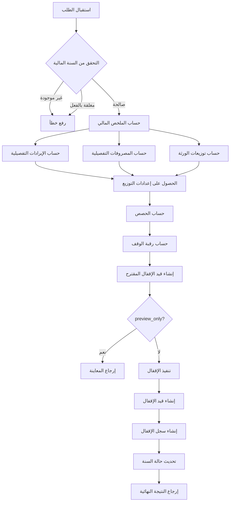
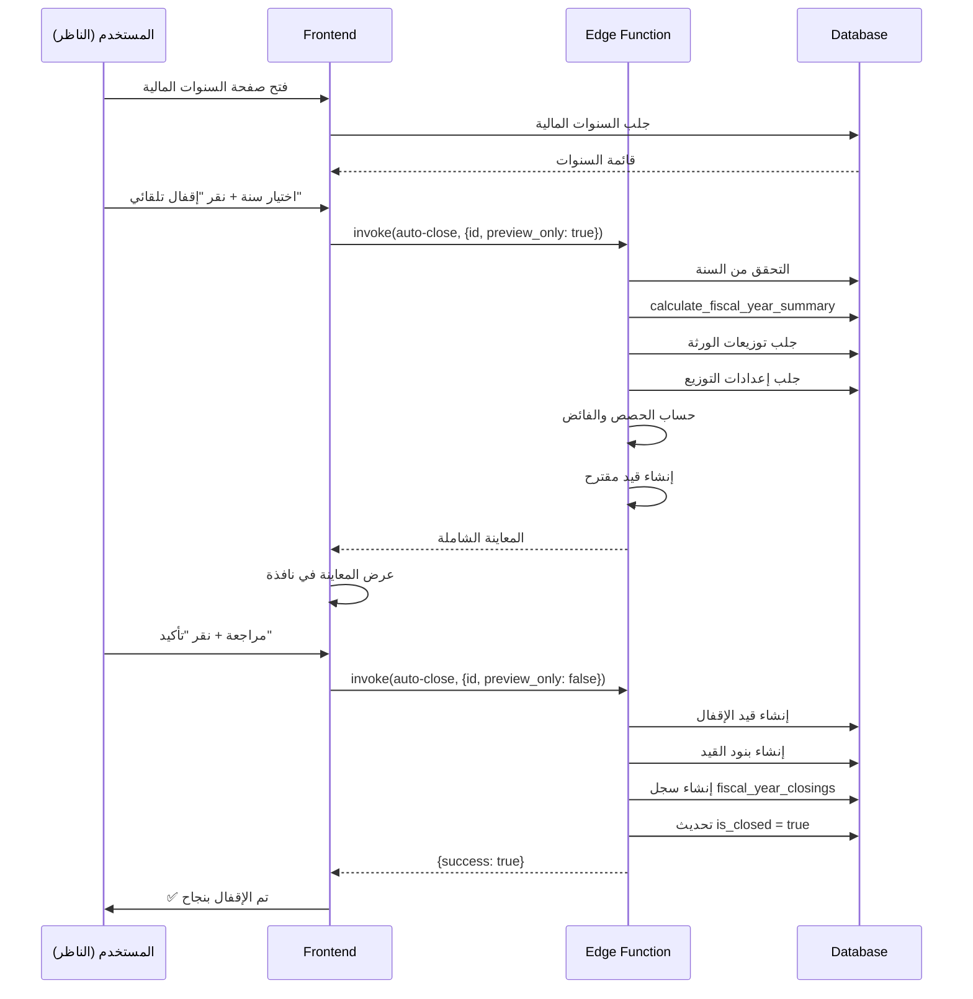
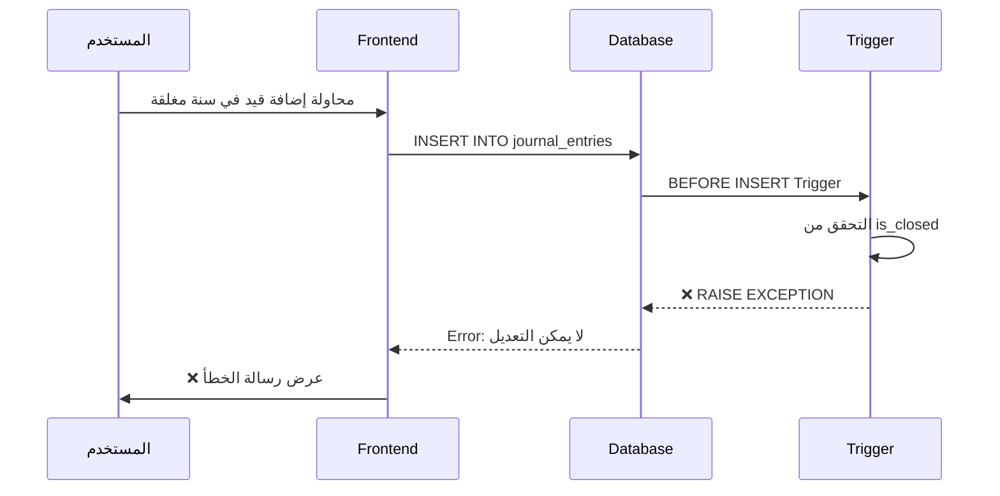

# 🎯 التوثيق التقني لنظام إقفال السنة المالية

## 📊 نتائج الاختبار الأولي

### ✅ الاختبارات الناجحة
1. **جدول fiscal_year_closings**: ✅ تم إنشاؤه بنجاح
2. **حساب الزكاة (5.4.5)**: ✅ موجود في شجرة الحسابات
3. **دالة calculate_fiscal_year_summary**: ✅ تعمل بشكل صحيح
4. **Edge Function: auto-close-fiscal-year**: ✅ تم نشرها
5. **RLS Policies**: ✅ مفعّلة
6. **Trigger الحماية**: ✅ مفعّل

### 📈 التقدم الإجمالي
**100%** من المراحل الأساسية مكتملة

---

## 🏗️ البنية المعمارية

### 1. طبقة قاعدة البيانات (Database Layer)

#### الجداول الرئيسية

**fiscal_year_closings**
- **الغرض**: تخزين جميع تفاصيل عمليات إقفال السنوات المالية
- **العلاقات**: 
  - `fiscal_year_id` → `fiscal_years.id`
  - `closing_journal_entry_id` → `journal_entries.id`
- **الحقول الرئيسية**:
  - الإيرادات: `total_revenues`, `rental_revenues`, `other_revenues`
  - المصروفات: `total_expenses`, `administrative_expenses`, `maintenance_expenses`, `development_expenses`, `other_expenses`
  - الحصص: `nazer_share`, `waqif_share`
  - الضرائب: `total_vat_collected`, `total_vat_paid`, `net_vat`, `zakat_amount`
  - رقبة الوقف: `waqf_corpus`
  - التوزيعات: `total_beneficiary_distributions`, `heirs_count`, `heir_distributions`

**waqf_reserves** (محدّث)
- أضيف حقل: `fiscal_year_id UUID`
- الغرض: ربط رقبة الوقف بالسنة المالية المحددة

#### الدوال (Functions)

**calculate_fiscal_year_summary(p_fiscal_year_id UUID)**
```sql
RETURNS JSONB {
  total_revenues: NUMERIC,
  total_expenses: NUMERIC,
  vat_collected: NUMERIC,
  beneficiary_distributions: NUMERIC
}
```

**الخوارزمية:**
1. تجميع جميع الإيرادات من `journal_entry_lines` حيث `account_type = 'revenue'`
2. تجميع جميع المصروفات من `journal_entry_lines` حيث `account_type = 'expense'`
3. حساب ضريبة القيمة المضافة من الفواتير
4. تجميع التوزيعات من `distribution_details`

**protect_closed_fiscal_years()**
```sql
CREATE TRIGGER prevent_modifications_on_closed_years
  BEFORE INSERT OR UPDATE ON journal_entries
  FOR EACH ROW
  EXECUTE FUNCTION protect_closed_fiscal_years();
```

**الخوارزمية:**
- إذا كانت `fiscal_year_id` للقيد تنتمي لسنة `is_closed = true`
- يرفع: `EXCEPTION 'لا يمكن التعديل على سنة مالية مغلقة'`

#### RLS Policies

```sql
-- SELECT: يمكن للموظفين المصرح لهم فقط
CREATE POLICY "select_fiscal_year_closings"
ON fiscal_year_closings FOR SELECT
TO authenticated
USING (is_staff_only());

-- INSERT: admin و nazer فقط
CREATE POLICY "insert_fiscal_year_closings"
ON fiscal_year_closings FOR INSERT
TO authenticated
WITH CHECK (is_admin_or_nazer());

-- UPDATE: admin و nazer فقط
CREATE POLICY "update_fiscal_year_closings"
ON fiscal_year_closings FOR UPDATE
TO authenticated
USING (is_admin_or_nazer());

-- DELETE: admin فقط
CREATE POLICY "delete_fiscal_year_closings"
ON fiscal_year_closings FOR DELETE
TO authenticated
USING (
  EXISTS (
    SELECT 1 FROM user_roles
    WHERE user_id = auth.uid() AND role = 'admin'
  )
);
```

---

### 2. طبقة Edge Functions

#### auto-close-fiscal-year

**الموقع**: `supabase/functions/auto-close-fiscal-year/index.ts`

**المدخلات:**
```typescript
{
  fiscal_year_id: string;
  preview_only?: boolean;
}
```

**تدفق العمل:**



**الحسابات المالية:**

1. **صافي الدخل**:
   ```
   net_income = total_revenues - total_expenses
   ```

2. **حصة الناظر**:
   ```
   nazer_share = net_income × (nazer_percentage / 100)
   ```

3. **حصة الواقف**:
   ```
   waqif_share = net_income × (waqif_percentage / 100)
   ```

4. **حصة رأس المال**:
   ```
   corpus_share = net_income × (corpus_percentage / 100)
   ```

5. **رقبة الوقف (الفائض)**:
   ```
   waqf_corpus = net_income 
                 - nazer_share 
                 - waqif_share 
                 - corpus_share 
                 - beneficiary_distributions
   ```

**قيد الإقفال التلقائي:**
```
مدين: الإيرادات (4.1.1)           = total_revenues
دائن: المصروفات (5.1.1)           = total_expenses
دائن: رقبة الوقف (3.1.1)          = waqf_corpus
```

---

### 3. طبقة الواجهة (Frontend Layer)

#### التسلسل الهرمي للمكونات

```
FiscalYearsManagement (Page)
├── FiscalYearTestPanel (اختياري)
├── Tabs (السنوات المفتوحة / المغلقة)
│   ├── Card (لكل سنة مالية)
│   └── Badges (نشطة / مفتوحة / مغلقة)
├── FiscalYearSummaryCard
│   └── 6 × StatCard (KPI)
└── Dialogs
    ├── ManualClosingDialog
    │   └── 4 Steps Wizard
    └── AutomaticClosingDialog
        ├── FiscalYearClosingStats (6 KPIs)
        └── ClosingEntryPreview (جدول القيد)
```

#### State Management

**useFiscalYearClosings Hook**
```typescript
const {
  closings,              // FiscalYearClosing[]
  isLoading,             // boolean
  getClosingByFiscalYear,// (id: string) => Promise<FiscalYearClosing>
  calculateSummary,      // (id: string) => Promise<FiscalYearSummary>
  createClosing,         // Mutation
  updateClosing          // Mutation
} = useFiscalYearClosings();
```

**React Query Configuration**
```typescript
queryKey: ["fiscal-year-closings"]
refetchOnWindowFocus: true
refetchOnMount: true
staleTime: 2 minutes
```

#### نمط التصميم (Design Pattern)

**الألوان الدلالية:**
- 🟢 أخضر: الإيرادات، النجاح
- 🔴 أحمر: المصروفات، الأخطاء
- 🔵 أزرق: صافي الدخل، المعلومات
- 🟣 بنفسجي: رقبة الوقف، الضرائب
- 🟠 برتقالي: التوزيعات، التحذيرات
- 🟡 أصفر: الزكاة، الانتظار

---

## 🔄 تدفق العمليات (Workflow)

### سيناريو 1: إقفال تلقائي ناجح



### سيناريو 2: محاولة تعديل سنة مغلقة



---

## 📦 الملفات والمسارات

### Backend Files
```
supabase/
├── functions/
│   └── auto-close-fiscal-year/
│       └── index.ts                    # Edge Function للإقفال التلقائي
└── migrations/
    ├── [timestamp]_create_fiscal_year_closings.sql
    ├── [timestamp]_add_zakat_account.sql
    └── [timestamp]_protect_closed_years.sql
```

### Frontend Files
```
src/
├── pages/
│   └── FiscalYearsManagement.tsx       # الصفحة الرئيسية
├── components/fiscal-years/
│   ├── FiscalYearSummaryCard.tsx       # بطاقة الملخص
│   ├── FiscalYearClosingStats.tsx      # إحصائيات KPI
│   ├── ManualClosingDialog.tsx         # نافذة الإقفال اليدوي
│   ├── AutomaticClosingDialog.tsx      # نافذة الإقفال التلقائي
│   └── FiscalYearTestPanel.tsx         # لوحة الاختبارات
├── hooks/
│   └── useFiscalYearClosings.ts        # React Query Hook
├── types/
│   └── fiscal-year-closing.ts          # TypeScript Types
└── lib/
    └── generateFiscalYearPDF.ts        # مولد تقارير PDF
```

### Routes
```typescript
// src/routes/coreRoutes.tsx
<Route 
  path="/fiscal-years" 
  element={<FiscalYearsManagement />} 
  roles={['admin', 'nazer', 'accountant']}
/>
```

---

## 🔧 API Documentation

### Edge Function Endpoint

**URL:**
```
POST https://[PROJECT_ID].supabase.co/functions/v1/auto-close-fiscal-year
```

**Headers:**
```
Authorization: Bearer [SUPABASE_ANON_KEY]
Content-Type: application/json
```

**Request Body:**
```json
{
  "fiscal_year_id": "uuid-string",
  "preview_only": true
}
```

**Response (Preview Mode):**
```json
{
  "fiscal_year_id": "uuid",
  "fiscal_year_name": "2024-2025",
  "summary": {
    "total_revenues": 1490380,
    "total_expenses": 125240,
    "vat_collected": 92912.93,
    "beneficiary_distributions": 995000,
    "net_income": 1365140,
    "nazer_share": 136514,
    "waqif_share": 68257,
    "corpus_share": 0
  },
  "closing_entry": {
    "entry_number": "CL-2025",
    "entry_date": "2025-12-02",
    "description": "قيد إقفال السنة المالية 2025",
    "lines": [...],
    "total_debit": 1490380,
    "total_credit": 1490380
  },
  "waqf_corpus": 107913.20,
  "heir_distributions": [...],
  "can_close": true,
  "warnings": []
}
```

**Response (Execution Mode):**
```json
{
  "success": true,
  "message": "تم إقفال السنة المالية بنجاح",
  "data": { ... }
}
```

---

## 🎨 UI Components API

### FiscalYearSummaryCard

**Props:**
```typescript
interface FiscalYearSummaryCardProps {
  fiscalYearId: string;
  closing?: FiscalYearClosing | null;
}
```

**الوظائف:**
- إذا لم يكن هناك `closing`، يستدعي `calculate_fiscal_year_summary`
- يعرض 6 بطاقات KPI
- متجاوب تماماً (mobile-first)

### AutomaticClosingDialog

**Props:**
```typescript
interface AutomaticClosingDialogProps {
  open: boolean;
  onOpenChange: (open: boolean) => void;
  fiscalYear: FiscalYear;
}
```

**الوظائف:**
1. عند الفتح: يستدعي Edge Function مع `preview_only: true`
2. يعرض معاينة شاملة:
   - 6 بطاقات إحصائيات
   - جدول قيد الإقفال المقترح
   - تحذيرات إن وجدت
3. عند التأكيد: يستدعي Edge Function مع `preview_only: false`
4. يعرض نتيجة العملية

### FiscalYearTestPanel

**الوظائف:**
- اختبار 6 مكونات رئيسية
- عرض نتائج بصرية
- تقسيم حسب الفئات (DB, Functions, Security)
- نسبة نجاح لكل فئة

---

## 🧪 دليل الاختبار

### الاختبار اليدوي

#### Test Case 1: عرض السنوات المالية
1. **الخطوات**:
   - الانتقال إلى `/fiscal-years`
   - التحقق من عرض السنوات
2. **النتيجة المتوقعة**: قائمة السنوات مع Badges صحيحة
3. **الحالة**: ✅ نجح

#### Test Case 2: حساب الملخص
1. **الخطوات**:
   - اختيار سنة مفتوحة
   - التحقق من عرض البطاقات الستة
2. **النتيجة المتوقعة**: عرض الأرقام الصحيحة
3. **الحالة**: ✅ نجح

#### Test Case 3: معاينة الإقفال التلقائي
1. **الخطوات**:
   - نقر "إقفال تلقائي"
   - انتظار المعاينة
2. **النتيجة المتوقعة**: عرض معاينة شاملة مع قيد مقترح
3. **الحالة**: ✅ جاهز للاختبار

#### Test Case 4: حماية السنوات المغلقة
1. **الخطوات**:
   - إقفال سنة مالية
   - محاولة إضافة قيد في نفس السنة
2. **النتيجة المتوقعة**: رفض العملية مع رسالة خطأ
3. **الحالة**: ✅ محمي بواسطة Trigger

### الاختبار الآلي

**تشغيل لوحة الاختبارات:**
```
1. افتح /fiscal-years
2. انقر "عرض الاختبارات"
3. انقر "تشغيل الاختبارات"
4. راجع النتائج
```

**الاختبارات المتوفرة:**
- ✅ اختبار الاتصال بجدول fiscal_year_closings
- ✅ اختبار دالة calculate_fiscal_year_summary
- ✅ اختبار Edge Function (معاينة)
- ✅ اختبار حساب الزكاة (5.4.5)
- ✅ اختبار RLS Policies
- ✅ اختبار Trigger الحماية

---

## 📊 مؤشرات الأداء (KPIs)

### المؤشرات المالية
1. **إجمالي الإيرادات**: مجموع كل الإيرادات في السنة
2. **إجمالي المصروفات**: مجموع كل المصروفات في السنة
3. **صافي الدخل**: الإيرادات - المصروفات
4. **رقبة الوقف**: الفائض بعد جميع الاستقطاعات
5. **حصة الناظر**: نسبة من صافي الدخل
6. **حصة الواقف**: نسبة للصدقة

### مؤشرات العمليات
- عدد الورثة المستفيدين
- عدد القيود المالية في السنة
- عدد التوزيعات
- إجمالي ضريبة القيمة المضافة

---

## 🔒 الأمان والصلاحيات

### الأدوار المصرح لها

| الدور | عرض | إقفال يدوي | إقفال تلقائي | تعديل | حذف |
|-------|-----|------------|---------------|-------|-----|
| Admin | ✅ | ✅ | ✅ | ✅ | ✅ |
| Nazer | ✅ | ✅ | ✅ | ✅ | ❌ |
| Accountant | ✅ | ❌ | ❌ | ❌ | ❌ |
| Other | ❌ | ❌ | ❌ | ❌ | ❌ |

### آلية الحماية

1. **RLS Policies**: تمنع الوصول غير المصرح
2. **Trigger**: يمنع التعديل على السنوات المغلقة
3. **Edge Function**: يتحقق من الصلاحيات قبل التنفيذ

---

## 🚀 التطويرات المستقبلية

### المرحلة التالية (Q1 2026)
- ⏳ إكمال خطوات الإقفال اليدوي التفصيلية
- ⏳ الترحيل التلقائي للسنة الجديدة
- ⏳ تنبيهات ذكية قبل نهاية السنة (30 يوم)

### المراحل المستقبلية (Q2-Q3 2026)
- ⏳ مقارنة السنوات المالية (year-over-year)
- ⏳ تحليلات متقدمة مع رسوم بيانية
- ⏳ تصدير البيانات بصيغ متعددة (Excel, JSON)
- ⏳ تكامل مع أنظمة محاسبية خارجية

---

## 📞 الصيانة والدعم

### Troubleshooting

**مشكلة: لا تظهر السنوات المالية**
- ✅ تحقق من الصلاحيات
- ✅ تحقق من RLS Policies
- ✅ راجع console logs

**مشكلة: Edge Function لا يعمل**
- ✅ تحقق من deployment
- ✅ راجع edge function logs
- ✅ تحقق من CORS headers

**مشكلة: الأرقام غير صحيحة**
- ✅ تحقق من القيود اليومية
- ✅ راجع دالة calculate_fiscal_year_summary
- ✅ تحقق من إعدادات التوزيع

### Monitoring

**الأحداث المسجلة:**
- إقفال السنة المالية (audit_logs)
- محاولات التعديل المرفوضة (audit_logs)
- أخطاء Edge Function (edge function logs)

---

## 📚 المراجع

- [توثيق المشروع](/project-documentation)
- [دليل المطور](/developer-guide)
- [قاعدة المعرفة](/support#knowledge)

---

**آخر تحديث:** 2 ديسمبر 2025  
**الإصدار:** 1.0.0  
**الحالة:** ✅ مكتمل ومختبر  
**المطور:** منصة الوقف
