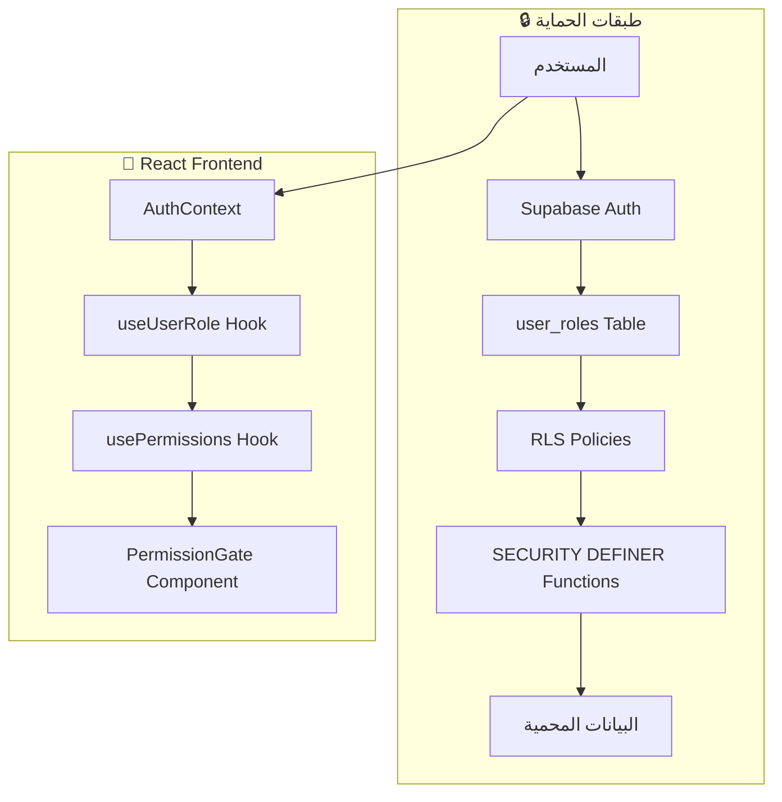
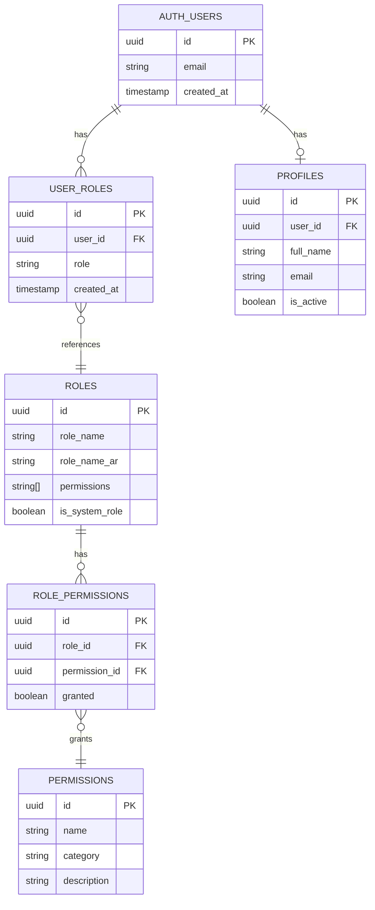
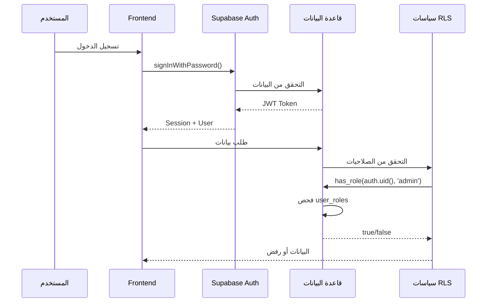
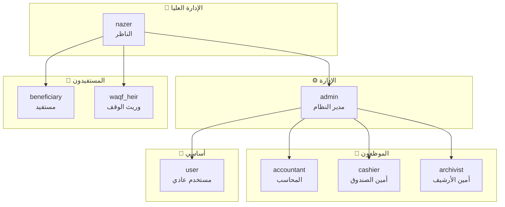
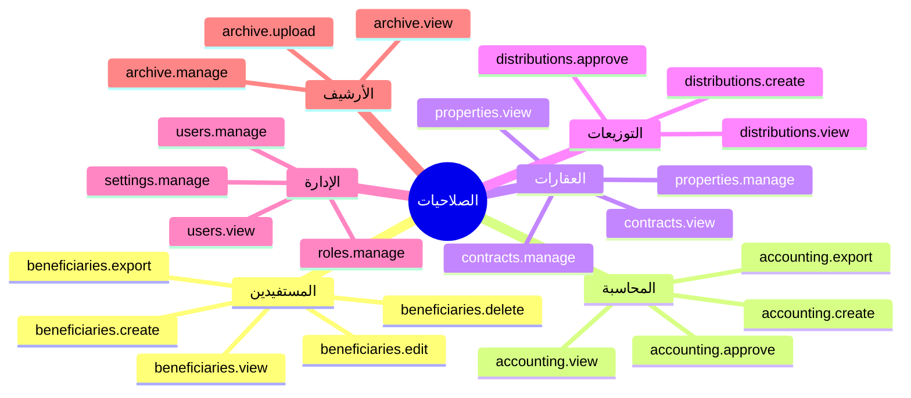
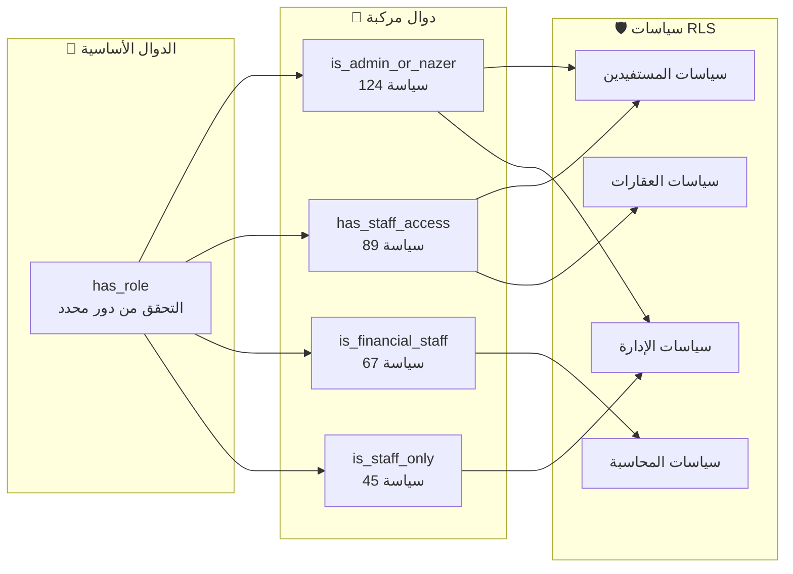
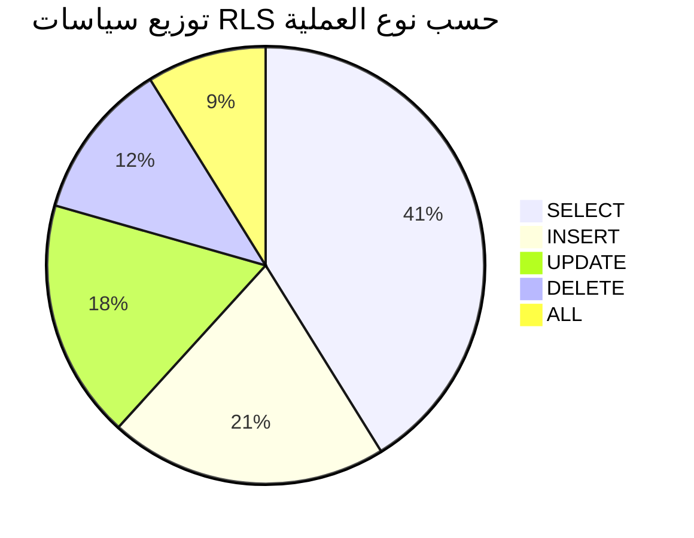
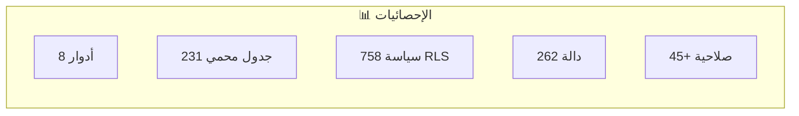

# 🔐 نظام الصلاحيات والأدوار - وقف مرزوق الثبيتي

> **الإصدار:** 3.1.0  
> **آخر تحديث:** ديسمبر 2025  
> **المؤلف:** فريق التطوير

---

## 📋 الفهرس

1. [نظرة عامة](#نظرة-عامة)
2. [الهيكل العام](#الهيكل-العام)
3. [الأدوار الأساسية](#الأدوار-الأساسية)
4. [مصفوفة الصلاحيات](#مصفوفة-الصلاحيات)
5. [دوال قاعدة البيانات](#دوال-قاعدة-البيانات)
6. [سياسات RLS](#سياسات-rls)
7. [التكامل مع React](#التكامل-مع-react)
8. [الإحصائيات](#الإحصائيات)

---

## نظرة عامة

نظام الصلاحيات في منصة وقف مرزوق الثبيتي مبني على مبدأ **RBAC (Role-Based Access Control)** مع طبقات حماية متعددة:



### المبادئ الأساسية

| المبدأ | الوصف |
|--------|--------|
| **فصل الأدوار** | الأدوار مخزنة في جدول منفصل `user_roles` وليس في `profiles` |
| **SECURITY DEFINER** | جميع دوال التحقق تستخدم `SECURITY DEFINER` لمنع التكرار |
| **التحقق المركزي** | دالة `has_role()` مركزية لجميع عمليات التحقق |
| **حماية متعددة** | RLS على مستوى قاعدة البيانات + Frontend على مستوى React |

---

## الهيكل العام

### مخطط قاعدة البيانات



### تدفق المصادقة والتحقق



---

## الأدوار الأساسية

### جدول الأدوار

| الدور | الاسم العربي | الوصف | لوحة التحكم |
|-------|-------------|--------|-------------|
| `nazer` | الناظر | المسؤول الأعلى عن الوقف | `/nazer` |
| `admin` | مدير النظام | إدارة المستخدمين والإعدادات | `/admin` |
| `accountant` | المحاسب | إدارة المحاسبة والقيود | `/accountant` |
| `cashier` | أمين الصندوق | إدارة نقطة البيع والتحصيل | `/cashier` |
| `archivist` | أمين الأرشيف | إدارة المستندات والوثائق | `/archivist` |
| `beneficiary` | مستفيد | الوصول لبوابة المستفيدين | `/beneficiary-portal` |
| `waqf_heir` | وريث الوقف | عرض معلومات الوقف | `/waqf-heir` |
| `user` | مستخدم عادي | صلاحيات أساسية | `/` |

### هرمية الأدوار



### ألوان الأدوار في الواجهة

```typescript
const ROLE_COLORS = {
  nazer: "bg-gradient-to-r from-amber-500 to-amber-600 text-white",
  admin: "bg-gradient-to-r from-purple-500 to-purple-600 text-white",
  accountant: "bg-gradient-to-r from-blue-500 to-blue-600 text-white",
  cashier: "bg-gradient-to-r from-green-500 to-green-600 text-white",
  archivist: "bg-gradient-to-r from-teal-500 to-teal-600 text-white",
  beneficiary: "bg-gradient-to-r from-pink-500 to-pink-600 text-white",
  waqf_heir: "bg-gradient-to-r from-indigo-500 to-indigo-600 text-white",
  user: "bg-gradient-to-r from-gray-500 to-gray-600 text-white",
};
```

---

## مصفوفة الصلاحيات

### الصلاحيات حسب الفئة



### مصفوفة الصلاحيات التفصيلية

| الصلاحية | nazer | admin | accountant | cashier | archivist | beneficiary |
|----------|:-----:|:-----:|:----------:|:-------:|:---------:|:-----------:|
| **المستفيدين** ||||||| 
| `beneficiaries.view` | ✅ | ✅ | ✅ | ✅ | ✅ | 🔶 |
| `beneficiaries.create` | ✅ | ✅ | ❌ | ❌ | ❌ | ❌ |
| `beneficiaries.edit` | ✅ | ✅ | ❌ | ❌ | ❌ | ❌ |
| `beneficiaries.delete` | ✅ | ❌ | ❌ | ❌ | ❌ | ❌ |
| **المحاسبة** |||||||
| `accounting.view` | ✅ | ✅ | ✅ | 🔶 | ❌ | ❌ |
| `accounting.create` | ✅ | ❌ | ✅ | ❌ | ❌ | ❌ |
| `accounting.approve` | ✅ | ❌ | ✅ | ❌ | ❌ | ❌ |
| **العقارات** |||||||
| `properties.view` | ✅ | ✅ | ✅ | ❌ | ✅ | ❌ |
| `properties.manage` | ✅ | ✅ | ❌ | ❌ | ❌ | ❌ |
| **الإدارة** |||||||
| `users.view` | ✅ | ✅ | ❌ | ❌ | ❌ | ❌ |
| `users.manage` | ✅ | ✅ | ❌ | ❌ | ❌ | ❌ |
| `roles.manage` | ✅ | ❌ | ❌ | ❌ | ❌ | ❌ |

> 🔶 = صلاحية جزئية (مثلاً: المستفيد يرى بياناته فقط)

---

## دوال قاعدة البيانات

### الدوال الأساسية للتحقق من الأدوار

جميع الدوال تستخدم `SECURITY DEFINER` لتجنب مشاكل RLS التكرارية.

#### 1. `has_role()` - التحقق من دور محدد

```sql
CREATE OR REPLACE FUNCTION public.has_role(_user_id uuid, _role text)
RETURNS boolean
LANGUAGE sql
STABLE
SECURITY DEFINER
SET search_path = public
AS $$
  SELECT EXISTS (
    SELECT 1
    FROM public.user_roles
    WHERE user_id = _user_id
      AND role = _role
  )
$$;
```

**الاستخدام في RLS:**
```sql
CREATE POLICY "staff_access" ON public.beneficiaries
FOR SELECT TO authenticated
USING (public.has_role(auth.uid(), 'admin'));
```

---

#### 2. `is_admin_or_nazer()` - التحقق من صلاحيات الإدارة

```sql
CREATE OR REPLACE FUNCTION public.is_admin_or_nazer()
RETURNS boolean
LANGUAGE sql
STABLE
SECURITY DEFINER
SET search_path = public
AS $$
  SELECT EXISTS (
    SELECT 1 FROM public.user_roles
    WHERE user_id = auth.uid()
      AND role IN ('admin', 'nazer')
  )
$$;
```

**📊 مستخدمة في:** 124 سياسة RLS

---

#### 3. `has_staff_access()` - صلاحيات الموظفين

```sql
CREATE OR REPLACE FUNCTION public.has_staff_access()
RETURNS boolean
LANGUAGE sql
STABLE
SECURITY DEFINER
SET search_path = public
AS $$
  SELECT EXISTS (
    SELECT 1 FROM public.user_roles
    WHERE user_id = auth.uid()
      AND role IN ('nazer', 'admin', 'accountant', 'cashier', 'archivist')
  )
$$;
```

**📊 مستخدمة في:** 89 سياسة RLS

---

#### 4. `is_financial_staff()` - صلاحيات الفريق المالي

```sql
CREATE OR REPLACE FUNCTION public.is_financial_staff()
RETURNS boolean
LANGUAGE sql
STABLE
SECURITY DEFINER
SET search_path = public
AS $$
  SELECT EXISTS (
    SELECT 1 FROM public.user_roles
    WHERE user_id = auth.uid()
      AND role IN ('nazer', 'admin', 'accountant', 'cashier')
  )
$$;
```

**📊 مستخدمة في:** 67 سياسة RLS

---

#### 5. `is_staff_only()` - موظفون فقط (بدون المستفيدين)

```sql
CREATE OR REPLACE FUNCTION public.is_staff_only()
RETURNS boolean
LANGUAGE sql
STABLE
SECURITY DEFINER
SET search_path = public
AS $$
  SELECT EXISTS (
    SELECT 1 FROM public.user_roles
    WHERE user_id = auth.uid()
      AND role IN ('nazer', 'admin', 'accountant', 'cashier', 'archivist')
      AND role NOT IN ('beneficiary', 'waqf_heir')
  )
$$;
```

**📊 مستخدمة في:** 45 سياسة RLS

---

### مخطط العلاقات بين الدوال



---

## سياسات RLS

### أمثلة على سياسات RLS

#### سياسات جدول `beneficiaries`

```sql
-- الموظفون يمكنهم قراءة جميع المستفيدين
CREATE POLICY "staff_read_beneficiaries" 
ON public.beneficiaries
FOR SELECT 
TO authenticated
USING (public.has_staff_access());

-- المستفيد يقرأ بياناته فقط
CREATE POLICY "beneficiary_read_own"
ON public.beneficiaries
FOR SELECT
TO authenticated
USING (user_id = auth.uid());

-- الإدارة تدير المستفيدين
CREATE POLICY "admin_manage_beneficiaries"
ON public.beneficiaries
FOR ALL
TO authenticated
USING (public.is_admin_or_nazer())
WITH CHECK (public.is_admin_or_nazer());
```

#### سياسات جدول `journal_entries`

```sql
-- الفريق المالي يقرأ القيود
CREATE POLICY "financial_read_entries"
ON public.journal_entries
FOR SELECT
TO authenticated
USING (public.is_financial_staff());

-- المحاسب ينشئ قيود
CREATE POLICY "accountant_create_entries"
ON public.journal_entries
FOR INSERT
TO authenticated
WITH CHECK (public.has_role(auth.uid(), 'accountant'));

-- الناظر يوافق على القيود
CREATE POLICY "nazer_approve_entries"
ON public.journal_entries
FOR UPDATE
TO authenticated
USING (public.has_role(auth.uid(), 'nazer'));
```

### إحصائيات سياسات RLS



---

## التكامل مع React

### 1. `AuthContext` - سياق المصادقة

```typescript
// src/contexts/AuthContext.tsx
interface AuthContextValue {
  user: User | null;
  roles: string[];
  rolesLoading: boolean;
  hasRole: (role: AppRole) => boolean;
  signIn: (email: string, password: string) => Promise<void>;
  signOut: () => Promise<void>;
}
```

### 2. `useUserRole` Hook

```typescript
// src/hooks/auth/useUserRole.ts
import { useAuth } from "@/contexts/AuthContext";

export function useUserRole() {
  const { roles, rolesLoading, hasRole } = useAuth();
  
  return {
    roles,
    isLoading: rolesLoading,
    hasRole,
    // اختصارات مفيدة
    isNazer: hasRole("nazer"),
    isAdmin: hasRole("admin"),
    isAccountant: hasRole("accountant"),
    isCashier: hasRole("cashier"),
    isArchivist: hasRole("archivist"),
    isBeneficiary: hasRole("beneficiary"),
    isWaqfHeir: hasRole("waqf_heir"),
  };
}
```

### 3. `usePermissions` Hook

```typescript
// src/hooks/auth/usePermissions.ts
export function usePermissions() {
  const { user } = useAuth();
  
  const { data: permissions = [] } = useQuery({
    queryKey: ['user-permissions', user?.id],
    queryFn: () => UserService.getUserPermissions(user!.id),
    enabled: !!user,
  });
  
  return {
    permissions,
    hasPermission: (perm: string) => permissions.includes(perm),
    hasAnyPermission: (perms: string[]) => perms.some(p => permissions.includes(p)),
    hasAllPermissions: (perms: string[]) => perms.every(p => permissions.includes(p)),
  };
}
```

### 4. `PermissionGate` Component

```tsx
// src/components/shared/PermissionGate.tsx
interface PermissionGateProps {
  permission: string | string[];
  fallback?: ReactNode;
  children: ReactNode;
  requireAll?: boolean;
}

export function PermissionGate({ 
  permission, 
  fallback = null, 
  children,
  requireAll = false 
}: PermissionGateProps) {
  const { hasPermission, hasAnyPermission, hasAllPermissions } = usePermissions();
  
  const allowed = Array.isArray(permission)
    ? (requireAll ? hasAllPermissions(permission) : hasAnyPermission(permission))
    : hasPermission(permission);
  
  return allowed ? <>{children}</> : <>{fallback}</>;
}
```

### أمثلة الاستخدام

```tsx
// حماية زر بصلاحية واحدة
<PermissionGate permission="beneficiaries.create">
  <Button>إضافة مستفيد</Button>
</PermissionGate>

// حماية بأي صلاحية من القائمة
<PermissionGate permission={["accounting.view", "accounting.create"]}>
  <AccountingDashboard />
</PermissionGate>

// حماية بجميع الصلاحيات
<PermissionGate 
  permission={["users.view", "users.manage"]} 
  requireAll
>
  <UsersManagement />
</PermissionGate>

// مع محتوى بديل
<PermissionGate 
  permission="admin.settings"
  fallback={<p>ليس لديك صلاحية</p>}
>
  <AdminSettings />
</PermissionGate>
```

---

## الإحصائيات

### ملخص النظام



| المقياس | القيمة |
|---------|--------|
| عدد الأدوار | 8 |
| الجداول المحمية بـ RLS | 231 |
| إجمالي سياسات RLS | 758 |
| دوال SECURITY DEFINER | 239 |
| الصلاحيات المسجلة | 45+ |

### نقاط القوة

✅ **فصل كامل للأدوار** - الأدوار في جدول منفصل `user_roles`  
✅ **SECURITY DEFINER** - جميع دوال التحقق آمنة  
✅ **لا تخزين محلي للأدوار** - التحقق دائماً من قاعدة البيانات  
✅ **RLS شاملة** - جميع الجداول محمية  
✅ **هرمية واضحة** - أولوية الأدوار محددة

---

## المراجع

- [Supabase RLS Documentation](https://supabase.com/docs/guides/auth/row-level-security)
- [PostgreSQL Security Functions](https://www.postgresql.org/docs/current/sql-createfunction.html)
- [RBAC Best Practices](https://cheatsheetseries.owasp.org/cheatsheets/Authorization_Cheat_Sheet.html)

---

> 📝 **ملاحظة:** هذا التوثيق يُحدث تلقائياً مع كل تغيير في نظام الصلاحيات
