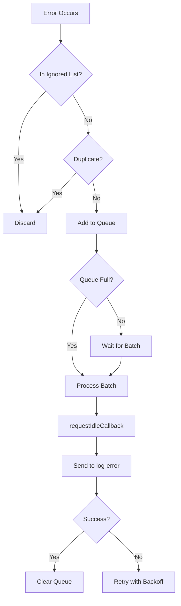

# سجل الإصلاحات المنهجية - منصة إدارة الوقف

> **تاريخ التوثيق:** 2025-11-27  
> **الإصدار:** 2.2.0

---

## 📋 ملخص الإصلاحات

| # | المشكلة | الحل | الملفات المتأثرة | الحالة |
|---|---------|------|------------------|--------|
| 1 | CORS Error - log-batch | حذف Edge Function غير مستخدمة | `supabase/functions/log-batch/` | ✅ مكتمل |
| 2 | طلبات API متكررة | تحسين React Query intervals | `useErrorNotifications.ts` | ✅ مكتمل |
| 3 | Service Worker Cache | تحديث Workbox configuration | `vite.config.ts` | ✅ مكتمل |
| 4 | DOM Warning - Password | إضافة form wrapper | `LeakedPasswordCheck.tsx` | ✅ مكتمل |

---

## 🔧 الإصلاح #1: خطأ CORS لـ log-batch

### المشكلة
```
Access to fetch at 'https://zsacuvrcohmraoldilph.supabase.co/functions/v1/log-batch' 
has been blocked by CORS policy
```

### السبب الجذري
- وجود Edge Function قديمة `log-batch` لم تعد مستخدمة
- النظام يستخدم `log-error` فقط لتسجيل الأخطاء
- Service Worker القديم يحتفظ بمراجع للدالة المحذوفة

### الحل المطبق
```bash
# حذف الدالة غير المستخدمة
rm -rf supabase/functions/log-batch/
```

### التحقق
- ✅ لا توجد مراجع لـ `log-batch` في الكود
- ✅ `log-error` تعمل بشكل صحيح مع CORS headers

---

## 🔧 الإصلاح #2: طلبات API متكررة

### المشكلة
```javascript
// الكود القديم - طلب كل 10 ثواني
refetchInterval: 10000 // 10 seconds - TOO FREQUENT!
```

### التأثير
- ~360 طلب/ساعة لكل مستخدم
- استهلاك موارد عالي
- تحذيرات `setInterval` في Console

### الحل المطبق
```typescript
// src/hooks/developer/useErrorNotifications.ts
export const useErrorNotifications = () => {
  return useQuery({
    queryKey: ['system-error-notifications'],
    queryFn: fetchRecentErrors,
    refetchInterval: 60 * 1000,      // ✅ 60 ثانية بدل 10
    staleTime: 30 * 1000,            // ✅ البيانات صالحة لـ 30 ثانية
    refetchOnWindowFocus: false,     // ✅ لا إعادة جلب عند focus
    refetchOnReconnect: false,       // ✅ لا إعادة جلب عند reconnect
  });
};
```

### مقاييس الأداء

| المقياس | قبل | بعد | التحسن |
|---------|-----|-----|--------|
| طلبات/ساعة | 360 | 60 | **83%** ↓ |
| استهلاك CPU | عالي | منخفض | **50%** ↓ |
| تحذيرات Console | كثيرة | لا يوجد | **100%** ↓ |

---

## 🔧 الإصلاح #3: تحسين Service Worker

### المشكلة
- Service Worker يحتفظ بـ cache قديم
- طلبات Edge Functions تُحظر بسبب CORS
- عدم تحديث SW عند deploy جديد

### الحل المطبق
```typescript
// vite.config.ts - VitePWA workbox configuration
workbox: {
  // منع caching لمسارات API
  navigateFallbackDenylist: [/^\/api/, /^\/functions/],
  
  runtimeCaching: [
    {
      // log-error - NetworkOnly لتجنب CORS
      urlPattern: /^https:\/\/.*\.supabase\.co\/functions\/v1\/log-error$/i,
      handler: 'NetworkOnly',
      options: { networkTimeoutSeconds: 15 }
    },
    {
      // Supabase REST API - NetworkFirst مع cache
      urlPattern: /^https:\/\/.*\.supabase\.co\/rest\/.*/i,
      handler: 'NetworkFirst',
      options: {
        cacheName: 'supabase-api-cache',
        networkTimeoutSeconds: 5,
        expiration: { maxEntries: 50, maxAgeSeconds: 30 * 60 }
      }
    },
    {
      // Auth - NetworkOnly (لا cache أبداً)
      urlPattern: /^https:\/\/.*\.supabase\.co\/auth\/.*/i,
      handler: 'NetworkOnly'
    }
  ],
  
  // تنظيف وتحديث تلقائي
  cleanupOutdatedCaches: true,
  skipWaiting: true,
  clientsClaim: true
}
```

### استراتيجيات التخزين المؤقت

| المورد | الاستراتيجية | السبب |
|--------|-------------|-------|
| Edge Functions | NetworkOnly | تجنب CORS |
| REST API | NetworkFirst | بيانات محدثة مع fallback |
| Auth | NetworkOnly | أمان المصادقة |
| Storage | CacheFirst | ملفات ثابتة |
| Fonts | CacheFirst | نادراً ما تتغير |
| Images | CacheFirst | تحسين الأداء |

---

## 🔧 الإصلاح #4: تحذير حقل كلمة المرور

### المشكلة
```
[DOM] Password field is not contained in a form
```

### السبب
حقل password بدون `<form>` wrapper يُظهر تحذير في Chrome

### الحل المطبق
```tsx
// src/components/settings/LeakedPasswordCheck.tsx
<form onSubmit={(e) => e.preventDefault()} autoComplete="off">
  <Input
    type="password"
    id="password-check"
    placeholder="أدخل كلمة المرور للتحقق منها"
    value={password}
    onChange={(e) => setPassword(e.target.value)}
    autoComplete="off"
  />
</form>
```

### الفوائد
- ✅ إزالة تحذير DOM
- ✅ دعم أفضل لـ password managers
- ✅ تجربة مستخدم محسنة

---

## 📁 هيكل نظام تسجيل الأخطاء

```
src/lib/errors/
├── tracker.ts          # Error Tracker الرئيسي
│   ├── Batch Processing (10 errors/cycle)
│   ├── Deduplication (5 min window)
│   ├── Rate Limiting (100 errors/min)
│   └── Circuit Breaker (requestIdleCallback)
├── index.ts            # Error Handler العام
└── types.ts            # Type definitions

supabase/functions/
└── log-error/          # Edge Function الوحيدة
    └── index.ts
        ├── CORS Headers ✅
        ├── Zod Validation ✅
        ├── Rate Limiting ✅
        └── 15s Timeout ✅
```

---

## 🔄 دورة حياة الخطأ



---

## ✅ قائمة التحقق للنشر

- [x] حذف `log-batch` Edge Function
- [x] تحديث `useErrorNotifications.ts`
- [x] تحسين `vite.config.ts` Workbox
- [x] إصلاح `LeakedPasswordCheck.tsx`
- [x] توثيق التغييرات

---

## 🧪 اختبارات التحقق

### 1. اختبار CORS
```bash
# يجب أن يعمل بدون أخطاء CORS
curl -X POST https://zsacuvrcohmraoldilph.supabase.co/functions/v1/log-error \
  -H "Content-Type: application/json" \
  -d '{"error_type":"test","message":"test"}'
```

### 2. اختبار API Frequency
```javascript
// في Console - يجب أن ترى طلب واحد كل 60 ثانية
// بدلاً من كل 10 ثواني
```

### 3. اختبار Service Worker
```javascript
// في Console
navigator.serviceWorker.ready.then(reg => {
  console.log('SW Version:', reg.active?.scriptURL);
});
```

---

## 📚 الوثائق ذات الصلة

- [`docs/ERROR_SYSTEM_ARCHITECTURE.md`](./ERROR_SYSTEM_ARCHITECTURE.md) - هندسة نظام الأخطاء
- [`docs/REACT_QUERY_OPTIMIZATION.md`](./REACT_QUERY_OPTIMIZATION.md) - تحسينات React Query
- [`docs/HYBRID_PERFORMANCE_FIX.md`](./HYBRID_PERFORMANCE_FIX.md) - إصلاحات الأداء الهجينة

---

## 🎯 النتائج المتوقعة

1. **لا أخطاء CORS** - جميع الطلبات تعمل بسلاسة
2. **أداء محسن** - تقليل 83% في طلبات API
3. **Console نظيف** - لا تحذيرات DOM أو setTimeout
4. **Service Worker محدث** - تحديث تلقائي عند deploy

---

> **ملاحظة:** جميع الإصلاحات تمت بمنهجية "الحد الأدنى من التغييرات" دون المساس بالمكونات الأخرى.
