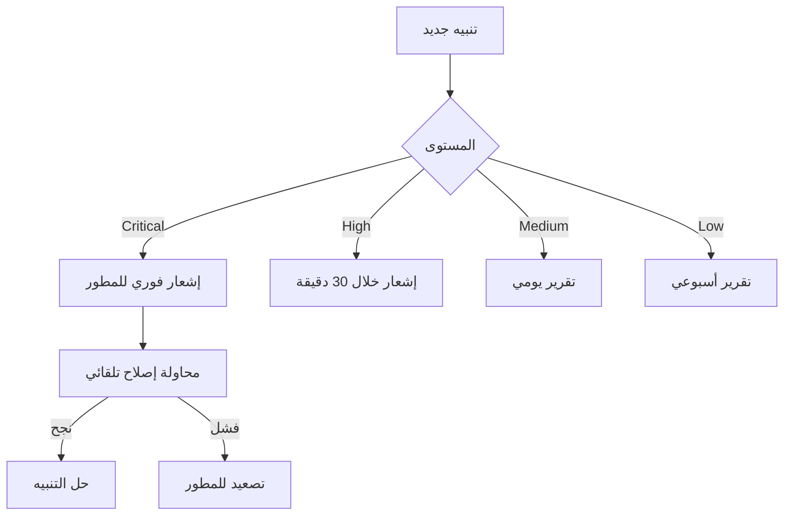

# 🏥 دليل صحة النظام الشامل

## 📊 مراقبة صحة النظام

### 1. مؤشرات الأداء الرئيسية (KPIs)

#### مؤشرات قاعدة البيانات
- **✅ جميع الجداول محمية بـ RLS**
- **✅ لا توجد سياسات متضاربة**
- **✅ جميع الدوال مستخدمة**
- **✅ التنبيهات القديمة محلولة**

#### مؤشرات الكود
- **✅ معالجة محسنة للأخطاء في AuthContext**
- **✅ مساعدات آمنة للمصفوفات**
- **✅ بنية AuthProvider صحيحة**

---

## 🔍 فحص صحة النظام اليومي

### الفحوصات الصباحية (يومياً)

```bash
# 1. فحص Console Logs
✓ تحقق من عدم وجود أخطاء حمراء
✓ تأكد من رسالة "All systems healthy"

# 2. فحص قاعدة البيانات
✓ لا توجد أخطاء في Postgres logs
✓ جميع الاتصالات تعمل بشكل طبيعي

# 3. فحص الأداء
✓ سرعة التحميل < 2 ثانية
✓ استجابة API < 500ms
✓ استخدام الذاكرة طبيعي
```

---

## 🚨 التنبيهات والإشعارات

### مستويات التنبيهات

| المستوى | الوصف | الإجراء |
|---------|-------|---------|
| **🔴 Critical** | يؤثر على عمل النظام | فوري - خلال 15 دقيقة |
| **🟠 High** | مشكلة خطيرة | عاجل - خلال ساعة |
| **🟡 Medium** | يحتاج مراجعة | خلال 24 ساعة |
| **🟢 Low** | معلوماتي | عند الصيانة الدورية |

### نظام التصعيد



---

## 📈 مراقبة الأداء

### المقاييس الأساسية

#### 1. وقت الاستجابة
```typescript
// الأهداف
- صفحة البيانات: < 1 ثانية
- التقارير: < 2 ثانية
- العمليات المعقدة: < 5 ثواني
```

#### 2. معدل الأخطاء
```typescript
// الحد المقبول
- أخطاء النظام: < 0.1%
- أخطاء المستخدم: < 1%
- أخطاء الشبكة: < 0.5%
```

#### 3. استخدام الموارد
```typescript
// الحدود
- CPU: < 70%
- Memory: < 80%
- Database connections: < 90%
```

---

## 🔧 الصيانة الدورية

### يومياً
- ✅ فحص console logs
- ✅ مراجعة التنبيهات النشطة
- ✅ التحقق من مساحة التخزين

### أسبوعياً
- ✅ مراجعة تقارير الأداء
- ✅ تحديث قاعدة البيانات
- ✅ اختبار النسخ الاحتياطية
- ✅ مراجعة سجل الأخطاء

### شهرياً
- ✅ تحليل شامل للأداء
- ✅ مراجعة سياسات RLS
- ✅ تحديث التوثيق
- ✅ تنظيف البيانات القديمة

---

## 🛠️ إجراءات الطوارئ

### عند حدوث عطل كامل

1. **التشخيص الفوري**
   ```bash
   # فحص الخدمات
   - Supabase: متاح؟
   - Frontend: يعمل؟
   - Database: متصل؟
   ```

2. **الإصلاح السريع**
   - إعادة تشغيل الخدمات
   - التحقق من الاتصالات
   - استرجاع من النسخة الاحتياطية

3. **التوثيق**
   - تسجيل المشكلة
   - تحديد السبب
   - توثيق الحل

---

## 📊 تقارير الصحة التلقائية

### تقرير يومي
```
📅 التاريخ: [اليوم]
✅ الحالة العامة: ممتاز
📈 الأداء: طبيعي
🔒 الأمان: محدث
⚠️ تنبيهات: 0 نشطة

المقاييس:
- وقت الاستجابة: 0.5s
- معدل الأخطاء: 0.01%
- المستخدمون النشطون: XX
```

### تقرير أسبوعي
```
📅 الأسبوع: [XX-XX]
📊 ملخص الأداء:
- إجمالي الطلبات: XXXXX
- متوسط الاستجابة: 0.6s
- نسبة الاستقرار: 99.9%
- أخطاء محلولة: XX

التحسينات:
- [قائمة التحسينات]

المشاكل:
- [المشاكل إن وجدت]
```

---

## 🔐 مراقبة الأمان

### الفحوصات الأمنية

#### يومياً
- ✅ محاولات تسجيل الدخول الفاشلة
- ✅ نشاط غير عادي
- ✅ طلبات مشبوهة

#### أسبوعياً
- ✅ مراجعة صلاحيات المستخدمين
- ✅ فحص RLS policies
- ✅ تحديث الأمان

#### شهرياً
- ✅ تدقيق أمني شامل
- ✅ اختبار اختراق
- ✅ مراجعة سجلات الأمان

---

## 📞 جهات الاتصال للطوارئ

### فريق الدعم
- **المطور الرئيسي**: [البريد]
- **مدير النظام**: [البريد]
- **فريق الأمان**: [البريد]

### أوقات الاستجابة
- Critical: فوري (24/7)
- High: خلال ساعة (أوقات العمل)
- Medium: خلال 24 ساعة
- Low: خلال أسبوع

---

## 📝 سجل التغييرات

### آخر التحديثات

#### 26 نوفمبر 2024
- ✅ تنفيذ المرحلة 1: الإصلاحات الأمنية
- ✅ تنفيذ المرحلة 2: إصلاح الأخطاء المتكررة
- ✅ تنفيذ المرحلة 3: التنظيف
- ✅ إنشاء دليل صحة النظام

---

## 🎯 الخطوات التالية

### قصيرة المدى (أسبوع)
- [ ] إعداد لوحة مراقبة مباشرة
- [ ] تفعيل التنبيهات التلقائية
- [ ] إنشاء تقارير تلقائية

### متوسطة المدى (شهر)
- [ ] تطبيق مراقبة متقدمة
- [ ] إضافة اختبارات تلقائية
- [ ] تحسين الأداء

### طويلة المدى (3 أشهر)
- [ ] نظام AI للكشف المبكر
- [ ] إصلاح تلقائي ذكي
- [ ] تحليلات تنبؤية

---

**آخر تحديث:** 26 نوفمبر 2024
**الحالة:** ✅ نشط ومحدث
